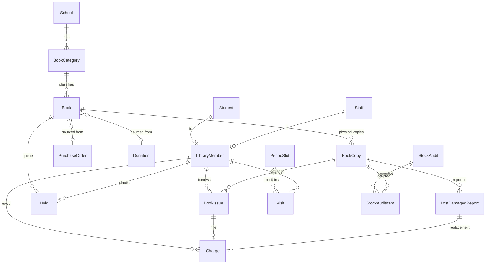

# ESKOOLIA LIBRARY MODULE — MASTER ARCHITECTURE BLUEPRINT

**Target module:** Library (prototype name "Library Pulse"). Prototype: https://claude.ai/artifact/GoRUTxuVCJEkiE26kiHt4A
**Audience:** an autonomous coding agent (Claude Code). No implementation code appears here. Follow the phases in order.
**Evidence labels:** `CONFIRMED` = seen in repo or prototype. `INFERRED` = derived from confirmed facts. `RECOMMENDED` = design choice. `OPEN` = needed a human decision. All are now locked in section 0b. `VERIFY FIRST` = not checked while writing this blueprint; inspect before relying on it.

**Agent operating rules (from CLAUDE.md, non-negotiable)**
- Do not start the backend or frontend dev servers. The user runs them.
- Use the `python` on PATH for every Python command. This machine has no `backend/venv` (section 0.2 explains the environment).
- Never add an `is_superuser` bypass to data scoping. Every queryset filters by `request.user.school_id`.
- Extend `apps/core` base classes. Do not bypass them.
- Background frontend fetches pass `{ silent401: true }`.
- No raw hex colours outside `frontend/styles/tokens.css`.
- Module visibility always goes through `useVisibleModules()`.
- Work on branch `library-r` only. Never push, never touch `demo2`, never run `git add -A` (section 0.2).
- Work through the 13 build prompts in `docs/LIBRARY_BUILD_PROMPTS.md`, one per session. Never run ahead of the current prompt.

---

<phase_0_existing_state_findings>

## 0. What already exists (this is an EXTENSION, not net-new)

**CONFIRMED backend.** `backend/apps/library/` already has 4 models, 4 ViewSets, 4 serializers and routes under `/api/v1/library/`. It is registered in `config/urls.py` and `INSTALLED_APPS`.

| Existing table | Fields today | Gap versus prototype |
|---|---|---|
| `library_book_categories` | school, name, description, is_active, created_at | No accession prefix code, no colour, no audit users |
| `library_books` | school, category, title, author, isbn, publisher, quantity, available_quantity, rack, timestamps | No edition, part, year, language, age band, audience, format, cost, call number, accession code, source, reference-only flag. Counters are stored, not derived. |
| `library_members` | school, member_type (student/staff), student, staff, card_no, is_active, created_at | No teacher type, no registration fee, no suspension logic |
| `library_book_issues` | school, book, member, issue/due/return dates, fine_amount, status (issued/returned/lost), issued_by, timestamps | No copy link, no renewal count, no fine paid/waived split, no returned_by |

**CONFIRMED frontend.** `frontend/app/(dashboard)/library/{books,categories,issues,members}/page.tsx` are 5-line wrappers around one 836-line `frontend/components/library/LibraryPanels.tsx`. The Library entry in `frontend/lib/routes.ts` is commented out with "HIDDEN - no backend yet". The teacher portal has no library code. The parent portal nav (`lib/parent-routes.ts`) has a placeholder Library entry under Academics that points to `/parent/home`.

**CONFIRMED defects in the existing code that the new build must not carry forward**
1. **Write actions are guarded by view-only codes.** Every ViewSet uses `permission_codes = {"*": "library.<x>.view"}`. Anyone who can view can also create, edit and delete. Only four `.view` codes are seeded in `seed_permissions.py`.
2. **Race condition on stock.** `available_quantity` is decremented in Python after an unlocked read. Two librarians issuing the last copy can both succeed.
3. **Client-trusted money.** `mark_returned` accepts `fine_amount` and `return_date` from the request body.
4. **Wrong uniqueness for a real catalogue.** `uq_lib_book_title_author` blocks two editions or volumes of the same title and author, which the prototype explicitly supports.
5. **Duplicate scoping class.** `SchoolScopedModelViewSet` in `apps/library/views.py` re-implements `TenantQueryMixin`. Its `initial()` has an `is_superuser` early return. That return only skips the permission check (data is still school-scoped, and `has_permission_code` already grants superusers), but it must go when moving to the core base classes.
6. **No `created_by` / `updated_by`** on any model, and no activity log.
7. **No standard envelope.** The library ViewSets do not use `APIResponseMixin`.

**Reusable foundations (CONFIRMED)**
- Scoping and base classes: `apps/core/portal_scoping.py::scope_to_school`, `apps/core/viewsets.py::PaginatedModelViewSet`, `apps/core/views.py::TenantQueryMixin` and `PermissionScopedViewSet`, `apps/core/base_serializers.py::AuditedModelSerializer` and `TenantScopedSerializer`.
- Cross-school FK pattern: `apps/competitions/serializers.py::ResultSerializer.validate()`. The existing `library/serializers.py` already applies the same idea inline.
- Portal scoping registry: `@register_portal_scope(Model, "teacher" | "parent")` used in `apps/teacher_portal/portal_scopes.py` and `apps/parent_portal/portal_scopes.py`. The parent source is `request.user.guardian_profile.students` (active) matched on `Student.current_class` and `current_section`. An unregistered (model, portal) pair returns nothing. The library portals do not use this registry (section 3.4).
- People: `students.Student` (`admission_no`, `current_class`, `current_section`, `status`), `hr.Staff`, `students.Guardian` and `StudentGuardian`.
- Timetable data: `core.ClassPeriod` (period, start_time, end_time, is_break), `core.ClassRoom`, `academics.ClassRoutineSlot`, `academics.ClassTeacherAssignment`, `core.AcademicYear`.
- Feature flag `library_enabled` exists in `apps/tenancy/feature_flags.py` and is plan-dependent.
- Frontend: `hooks/usePermissions.ts`, `hooks/useVisibleModules.ts`, `lib/api-auth.ts`, `lib/portal-modules.ts`, `hooks/useDocumentBranding.ts` (reuse for printed notices), `hooks/usePortalNotifications.ts`, `styles/tokens.css`.
- Notifications: `apps/communication` and `apps/core/services/parent_notifications.py` (SMS and email helpers).

### 0.1 Verified facts that override earlier assumptions

These were checked in the repository after the first draft. They are `CONFIRMED`. Where any later section disagrees, this table wins.

| # | Fact (evidence) | Consequence for the build |
|---|---|---|
| 1 | Portals are mounted at `/api/v1/teacher/` and `/api/v1/parent/` (`config/urls.py`). | Library portal endpoints live at `/api/v1/teacher/library/...` and `/api/v1/parent/library/...`, registered in `apps/teacher_portal/urls.py` and `apps/parent_portal/urls.py`. Not under `/api/v1/library/`. |
| 2 | Portal views are `APIView` classes with `authentication_classes = [JWTAuthentication]` and `IsTeacherPortalUser` or `IsParentPortalUser`. They return plain `Response` bodies, not the admin envelope. They use no permission codes. Both classes reject superusers. Teacher needs a role with `portal_type = teacher` and a linked `hr.Staff` record. Parent needs a role with `portal_type = parent` and a `guardian_profile`. | Library portal views copy this exactly. Do not add permission codes for portals. Do not use the admin `LibraryViewSet` for portal endpoints. |
| 3 | Parent scoping: `_resolve_child(request)` in `apps/parent_portal/views.py` reads `?child_id=` and requires `Student.guardian == request.user.guardian_profile` and `status = active`, else 404. Teacher scoping: `apps/teacher_portal/utils.py` (`get_attendance_scope(user)` returns `(class_id, section_id)` pairs of the teacher's class-teacher assignment, `get_current_academic_year(school)`). `ClassTeacherAssignment.teacher` points to `users.User`. | Reuse these helpers. Import them. Never re-implement scoping. |
| 4 | Frontend portals: nav lists are `lib/teacher-routes.ts` and `lib/parent-routes.ts`, always shown in full with no permission filter. Parent pages live in `app/(parent-portal)/parent/<page>/page.tsx`, read the selected child from `useParentChild()` (`contexts/ParentChildContext`) and call functions in `lib/api/parent.ts`. Teacher pages live in `app/(teacher-portal)/teacher/`. The parent nav already has a placeholder Library item pointing to `/parent/home`. | Portal screens follow the sibling pages. The admin hook `useLibraryApi.ts` is for the admin console only. |
| 5 | Push already exists: `apps/communication/realtime.py` sends to group `user_<id>`. `apps/chat/consumers.py::ChatConsumer.portal_notification` forwards the `notification` dict unchanged. `hooks/usePortalNotifications.ts` only types `kind: "message"`. | Add a generic best-effort push helper beside `push_new_message` and extend the TypeScript type with `kind: "library"`. No new WebSocket route. |
| 6 | In-app notifications: `CommunicationNotification` (recipient user, title, body, notification_type, link_url, is_read). The teacher bell reads it at `GET /api/v1/teacher/notifications/`. The parent portal has no equivalent endpoint. | Create a `CommunicationNotification` row for every library event. Teachers see it in the existing bell. Parents get the push and a page refetch. |
| 7 | Tier seeding is broken for dot-style codes. `seed_module_tiers.classify()` looks for patterns such as `.view_` and `_create$`. Codes like `library.books.view` and `library.books.create` match none, so every library code lands in the FULL tier. A role given library tier view, operate or manage gets an empty set. This also affects other modules. | Add an explicit library tier map (section 3.7). Do not change `classify()` for other modules. Report the shared issue to the user. |
| 8 | `TenantFeatureGateMiddleware` runs only when multi-tenancy is on. Its documented gate pattern is the legacy `^/api/library/`, not `/api/v1/library/`. The me payload exposes `enabled_features`. | If a `TENANT_FEATURE_GATES` setting exists, add `/api/v1/library/`, `/api/v1/teacher/library/` and `/api/v1/parent/library/`. Otherwise skip and report. Frontend uses `hasFeature('library_enabled')`. |
| 9 | Environment: no `backend/venv`. System Python 3.14.3 with Django 6.0.4, DRF 3.16.1, Celery 5.6.3, Channels 4.3.2, pytest-django 4.12, psycopg2 and psycopg. Production pins Django 5.1.8 (`requirements/base.txt`). Docker is installed. Test settings (`config/settings/test.py`) use `DATABASE_URL_TEST`, else a derived test database on the same server as `DATABASE_URL`, else SQLite. | Write code that runs on Django 5.1 and 6.0. Use `condition=` on `CheckConstraint` and `UniqueConstraint`, never `check=`. Never run `migrate` against the app database. |
| 10 | Git: the repository root is `eSkoolia-version1/`. Remote `origin` is the company GitHub repository. Work happens on local branch `library-r`, created from `demo2`. The working tree carried 19 uncommitted changes from other work. | Stage only library paths. Never `git add -A`. Never push. |
| 11 | `core.Class` has `name` and `numeric_order` (default 0, "for sorting"). Class names include Nursery, LKG, UKG and Grade 1 to 12. | The registration fee group is chosen from a stored class list, not from `numeric_order` (D6). |

### 0.2 Branch, environment and rules for every build prompt

1. **Branch.** Every session starts with `git branch --show-current`. It must print `library-r`. If it does not, run `git switch library-r`. Never create another branch, never touch `demo2`, never rebase, merge or force anything.
2. **Staging.** Stage only files you created or edited for the library module, by explicit path. Never run `git add -A` or `git add .`, because the tree holds other people's uncommitted work. Commit once at the end of the prompt with the message the prompt gives. **Never push.** The user pushes `library-r` themselves.
3. **Python.** Use `python` from PATH. Do not create a virtual environment. Do not install packages. If a package is missing, note it in `docs/LIBRARY_PROGRESS.md` and work around it.
4. **Django compatibility.** Production is Django 5.1.8. The machine runs 6.0.4. Write code that works on both. Use `condition=` in constraints. Avoid APIs that exist only in 6.0.
5. **Database.** Never run `manage.py migrate` against the app database (`DATABASE_URL` is a shared cloud database). Create migrations with `makemigrations`, check them with `makemigrations --check`, and prove them by running tests. List the new migrations in the final report so the user can apply them. Before the first test run, read `config/settings/test.py` and say which database the tests will use. A dedicated test database or SQLite is fine. Tests that need Postgres behaviour (row locks, partial index timing) use a skip-unless-Postgres marker and are reported as unverified when skipped.
6. **Servers.** Never start the backend, frontend, Celery, Redis or any dev server. The user does visual checks.
7. **Frontend checks.** From `frontend/` run `npx tsc --noEmit` and `npm run lint`. Run `npm test -- <pattern>` for any Jest test you add. Do not run `next build`.
8. **Single response.** Finish every item in the prompt in one response. Do not ask the user questions. Where the blueprint is silent, choose the simplest option that fits it and record the choice in `docs/LIBRARY_PROGRESS.md` under "Decisions made". If one part is blocked, complete everything else and say exactly what is blocked and why. No empty stubs and no TODO-only endpoints.
9. **Precedence.** Locked decisions (section 0b) beat verified facts (0.1), which beat all later sections.
10. **Scope.** Edit only the files the prompt lists, plus shared files the prompt names. Do not edit `apps/core/models.py`, `apps/users/models.py`, `config/settings/base.py` or `config/urls.py` unless the prompt says so.
11. **Handoff.** Read `docs/LIBRARY_PROGRESS.md` first and update it last. Prompt 1 creates it.
12. **Report.** End with a report of at most 20 lines: done, not done, decisions made, commands run with results, migrations to apply, and what the next prompt needs.

</phase_0_existing_state_findings>

<phase_0b_open_decisions>

## 0b. Locked decisions

These replace the earlier list of open questions. Each is final for V1 and is built as per-school configuration in `library_settings` where a number is involved. The reasoning covers the librarian desk, the teacher portal and the parent portal.

| # | Decision | Locked value | Why |
|---|---|---|---|
| D1 | Overdue fine | ₹10 per overdue day, no grace days, capped at the replacement cost of the copy (setting `cap_fine_at_replacement_cost`, default on) | Parents see the accrued fine in their portal. A cap stops a fine from ever exceeding what a lost book costs, which avoids disputes. |
| D2 | Borrowing limits | Student 2, teacher 5, staff 3 | From the prototype. Shown as "x of y allowed" in both portals. |
| D3 | Loan period | Student: due date is the class's next library period at least 10 days away. If the class has no library slot, 14 days. Teacher and staff: 14 days. | Students can only return books during their class library period, so the due date must land on one. |
| D4 | Renewals | Maximum 2. A waiting hold blocks renewal. An overdue loan cannot be renewed: return it, settle the fine, issue again. Teachers renew only their own loans, from the portal. | Keeps fines and holds fair. Self-service stays safe. |
| D5 | Replacement cost | Copy cost plus ₹50 handling. ₹150 when the copy cost is 0. | From the prototype. |
| D6 | Registration fee | ₹300 for the junior group, ₹500 for other students, ₹0 for teachers and staff. The junior group is a stored list of classes (setting `junior_class_ids`), filled on first creation from class names Nursery, LKG, UKG and Grade 1 to Grade 4. The amount is stored on the member and can be edited at registration. An unpaid registration fee does not suspend borrowing. | The prototype's sample data fits this split. A stored class list works for every school's naming. |
| D7 | Fees integration | Library keeps its own ledger (`library_charges`) in V1. Parents see library dues in the library page. Nothing posts to the Fees module. | Avoids touching the fees ledger. The charge table is shaped so an export can follow later. |
| D8 | Library periods | Dedicated `library_period_slots` table managed by the librarian. Teachers and parents see it read-only. | The timetable model needs a subject and a teacher, which a library period does not have. |
| D9 | "This term" in reports | The current academic year's date range, with `from` and `to` overrides on every report. | No term model is confirmed. |
| D10 | Vendors | Free text on purchase orders | Matches the prototype. |
| D11 | Teacher versus staff | At registration, `member_type` is teacher if the linked staff user holds an active role with `portal_type = teacher`, otherwise staff. The librarian can change it. Stored explicitly. | Uses the same signal the teacher portal already trusts. |
| D12 | Roles | The Librarian template gets every library code at tier full. Teacher and parent templates get none. Existing roles keep their view codes and lose accidental write access. The build lists which roles that affects. | Closes the write-with-view-code gap without breaking read access. |
| D13 | Student portal | Out of scope. Students have no library login. | Not in the prototype. |
| D14 | Ctrl-K search | Out of scope. | Shell feature. |
| D15 | Portal conventions | Teacher endpoints at `/api/v1/teacher/library/`, parent endpoints at `/api/v1/parent/library/`. `APIView`, `JWTAuthentication`, `IsTeacherPortalUser` or `IsParentPortalUser`, plain JSON, parent child chosen with `?child_id=` through `_resolve_child`. No permission codes. | Matches every sibling portal endpoint. |
| D16 | Teacher scope | My Class uses the class-teacher scope from `get_attendance_scope(user)`. No class-teacher assignment means an empty state. My Books uses the teacher's own member record, found through their staff profile. A teacher who is not registered sees a clear message. Recommend a Book is open to every teacher portal user. | Same scope rule as attendance, so a teacher can only see their own class. |
| D17 | Notifications | V1 channels are an in-app `CommunicationNotification` row plus a WebSocket push of kind `library` over the existing user group. SMS and email use the existing helpers but stay off behind setting `notify_sms_email_enabled` (default false). The librarian console polls every 30 seconds and receives no push. | In-app and push cover both portals at no extra cost. Paid providers stay off until the school turns them on. |
| D18 | Build environment | As in section 0.2: system Python, no venv, Django 5.1 and 6.0 compatible code, no `migrate` against the app database, branch `library-r`, never push. | Matches the machine and protects the shared database. |

</phase_0b_open_decisions>

---

<phase_1_reconnaissance>

## 1. Reconnaissance

### 1.1 Prototype inventory (CONFIRMED from the prototype source)

**Admin portal, Library module, 10 screens**

| # | Screen | What it does | Key rules found in the prototype |
|---|---|---|---|
| 1 | Console | KPI tiles (titles, collection value, available copies, active loans, overdue, lost/damaged pending). "Pulse" card for the live library period with check-in count. Due and overdue list with "Remind all overdue". Reservations and holds list. Collection mix by category. Recent activity. | Tiles are computed, not stored. |
| 2 | Catalogue | Title table: title and edition, call number, category, reader audience, age band, cost, copies, available, status (Available, Low stock at 34% or less, All issued), actions. Filters: search, category, age band, reader, condition, status. Buttons: Manage categories, Bulk import, New accession. Row actions: edit, copies register, reserve. | Reference-only titles cannot be issued home. Empty state: "No titles match this filter". |
| 3 | New accession wizard (5 steps) | 1 Identity (title, author, ISBN, publisher, year, language). 2 Who it is for (category, age band, readers, format, reference-only toggle). 3 Copies and cost (copies at least 1, cost per copy, total value, edition, part or volume). 4 Source and code (Purchased with vendor or Donated with donor, auto accession code, rack, remarks). 5 Review and save. | Required: title; category, age band and at least one reader; copies at least 1. Code format `LIB-<CAT>-<NNNN>` per category. Each copy gets `<code>/C<n>`. Editing and raising the copy count adds copies. |
| 4 | Bulk import | One line per title: Title, Author, Category, Copies, Cost. Preview shows valid and invalid rows, then "Add N books". | Category must match an existing category name. Copies default 1 and cost default 0. Errors: "Missing title", "Unrecognised category". |
| 5 | Copies register and scanner setup | Per-copy list (code, status, condition, last verified). Label printing. Scanner method picker: USB or Bluetooth keyboard-wedge (recommended), device camera, third option. | Scanner and camera are browser-only. The backend only needs lookup by exact code. |
| 6 | Manage categories | List with colour dot, prefix code, title count, active toggle. Add category. | Inactive categories are hidden from new accessions but stay on existing titles. Prefix is derived from the name. |
| 7 | Acquisitions | Annual budget summary. Purchase orders table (PO no, date, vendor, invoice, books, cost, status Ordered or Received, payment Pending or Paid). Donations (donor, type Parent, Alumni, Staff, Publisher, NGO or Trust, contact, books, estimated value, receipt no, acknowledgement sent, notes). Teacher requests list. Forms: New PO, Log a donation. | PO and receipt numbers auto-increment. Accessioning copies from a PO or donation stays a manual, per-title action in Catalogue. |
| 8 | Periods and Occupancy | Weekly grid (Mon to Sat by periods 1 to 8) of library periods per class and room, with a live marker. Live occupancy "checked in / scheduled". Visits-this-week bars per class. "Prep for next period" briefing. Simulated check-in via library card tap. | Anyone unscanned after 5 minutes is flagged to the class teacher. |
| 9 | Issue Desk | Tabs Issue, Return, Renew. One search box for title, author or accession code, with scanner support and suggestions. Issue: pick class, pick member, confirmation card, plus a bulk-issue-to-class helper. Return: shows borrower, fine, "Collect and return", "Waive fine and return", mark lost or damaged with a note, 6-second undo. Renew: shows renewal count, blocks at the cap. Daily "Today at the Desk" log. | See rules R1 to R9 in 1.4. |
| 10 | Lost and Damaged | Table: title, reported by, type (Lost or Damaged), date, notes (add a note inline), replacement cost, fee status (Charged or Paid), resolution (Pending or Resolved), actions (Bill, Mark fee paid, Write off). Pending count badge. Empty state "Nothing lost or damaged on record." | Missing copies found in a stock check become Lost reports with no borrower. |
| 11 | Members | Table: member, role, class, card number, active loans versus limit, registration fee (Paid, Unpaid, Waived), total dues, status (Active or Suspended). Role chips filter. | Suspended when overdue fines or unpaid replacement fees are above zero. Unpaid registration fee alone does not suspend. |
| 12 | Transactions and Logs | Append-only activity feed with type chips (accession, issue, return, renewal, lost, damaged, fine, donation, purchase, member, hold, teacher request), timestamp, details, staff. Export button. | Every state-changing action writes a row. |
| 13 | Reports and Oversight | Circulation by category (this term), monthly circulation trend, fine and fee collection (charged, collected, waived), budget versus spend. | Computed from real transactions. |
| 14 | Stock Check | Pick a rack or all racks, start, tick each on-shelf copy "found", progress bar, finish. Result shows accounted versus missing, value at risk, and "Mark as lost" per missing copy. | Only on-shelf copies are in scope. Issued, lost, damaged and withdrawn copies are excluded. |

**Teacher portal (3 screens):** My Class (next library period, books due back from the teacher's homeroom class, send reminder), My Books (own loans, self-service renew, shows "On hold for someone else" or "Renewal limit reached"), Recommend a Book (title and optional reason, list of own requests with status Pending).
**Parent portal (2 screens):** Current and Due (child switch, next library period, books out versus limit, overdue fine, replacement fees pending), History (loan and return history for the selected child).
**Printable documents (frontend print views):** overdue notice, replacement bill, donation receipt, copy labels.

### 1.2 Actors and portals

| Actor | Portal (`me.portal_type`) | Access |
|---|---|---|
| Librarian | `admin` or `custom` with library permission codes | All 14 screens, limited by granted codes |
| School admin | `admin` | All screens (`is_school_admin` grants every code in own school) |
| Superuser | `admin` | Same as any user: scoped to own school only |
| Teacher | `teacher` | My Class (own class-teacher scope only), My Books (own loans only), Recommend a Book. Endpoints at `/api/v1/teacher/library/` (D15, D16). |
| Parent | `parent` | Own children only, read-only. Endpoints at `/api/v1/parent/library/` with `?child_id=` (D15). |
| Student | `student` | Out of scope for V1 (D13) |

### 1.3 Entity extraction

Nouns needed to power every screen: Library settings, Book category, Book (title), Book copy, Library member, Loan (issue), Hold, Charge (fine, replacement fee, registration fee), Lost or damaged report, Purchase order, Donation, Annual budget, Library period slot, Visit (check-in), Stock audit, Stock audit item, Book request (teacher recommendation), Activity log entry.

### 1.4 Business rules extracted from the prototype

| ID | Rule |
|---|---|
| R1 | Reference-only titles cannot be issued for home use. |
| R2 | A loan needs an available copy of that title. Each loan binds to one specific copy. |
| R3 | A member is blocked from borrowing if suspended (pending overdue fine or unpaid replacement fee above zero) or already at their limit (D2). |
| R4 | Students may only hand a book back on a day their class has a library period, so their due date snaps to the class's next library slot at least the minimum days away (D3). Teachers and staff use a flat period. If a class has no library slot, fall back to the flat period. |
| R5 | Renewal is blocked at the renewal cap, when any hold exists on the title, and when the loan is overdue (D4). A successful renewal recomputes the due date by rule R4. |
| R6 | On return the copy goes back to available. If the loan was overdue the fine is either collected or waived. If holds exist on the title, a note and notification go to the queue. |
| R7 | A return can be undone within a short window (6.5 seconds in the prototype). Recommended server rule in Phase 2: the same user within 10 minutes, only if the copy has not been re-issued. |
| R8 | Marking a copy lost or damaged (at return, at stock check, or manually) creates a Lost or Damaged report and a replacement charge (D5). Lost sets the copy to lost. Damaged sets it to damaged. |
| R9 | Bulk issue to a class: eligible members are the class roster who are under their limit, not suspended, and not already holding this title, capped at the available copies. |
| R10 | Statuses `Due Today` and `Overdue` are derived from dates. `Renewed` is derived from renewal count above 0. Do not store them. |
| R11 | Catalogue status: All issued when available is 0. Low stock when available divided by copies is at most 0.34. Otherwise Available. Derived, not stored. |
| R12 | Accession code `LIB-<category prefix>-<4-digit sequence>` is unique per school and never reused. Copy code is `<book code>/C<n>`. |
| R13 | Inactive categories cannot be chosen for new titles but remain valid on existing titles. |
| R14 | Every state change writes one activity log entry attributed to the acting user. |
| R15 | Stock-check "mark as lost" applies only to copies still on the shelf and is idempotent. |
| R16 | Holds are a first-come queue per title. A member cannot hold a title they already hold or have out. |

### 1.5 Scoping strategy — every entity reaches `school_id`

**Rule:** every table in this module carries its own `school` ForeignKey to `tenancy.School`, including child tables (copies, visits, audit items). This is deliberate denormalisation. It lets every queryset filter directly on `school_id` through `scope_to_school`, keeps indexes simple, and removes any join-based scoping gap.

| Entity | Reaches school via |
|---|---|
| Settings, category, book, copy, member, loan, hold, charge, lost/damaged report, PO, donation, budget, period slot, visit, stock audit, audit item, book request, activity log | Direct `school` FK on the row |
| Teacher and parent portal reads | Direct `school` filter first, then the ownership rules in section 3.4 (guardian owns the child, student inside the class-teacher scope). |

### 1.6 UX states every screen must handle (not shown in the prototype)

| State | Requirement |
|---|---|
| Loading | Skeleton rows for tables, skeleton tiles on Console. Never show stale content as final. |
| Empty | Distinct empty copy per list. The prototype already defines two; add the rest. |
| No access | When `can()` is false, show a no-access state, not an empty list. `can()` is false while permissions load, so show loading first. |
| Error | Field errors inline from `field_errors`. Toast for action failures. 503 shows "temporarily unavailable". |
| Pagination | All lists paginated server-side (`page`, `page_size`). Catalogue, Members, Transactions and Issue lists expect thousands of rows. |
| Conflict | 409 on double return, double issue, duplicate code. Message tells the librarian what changed. |
| Confirmation | Destructive actions (withdraw copy, delete PO, write off, cancel audit) need a confirm dialog. Routine returns use the undo toast instead. |
| Offline or scanner failure | Search box must keep working by typing. Camera unsupported shows a note, not an error. |
| Dues blocking | Issue confirmation shows why a member is blocked (suspended or at limit) with the amount owed. |
| Concurrency | If a copy was issued by another desk a moment ago, show the 409 reason and refresh the suggestion list. |

</phase_1_reconnaissance>

---

<phase_2_database_and_api_design>

## 2. Database and API contracts

### 2.1 Physical tables (18 total: 4 modified, 14 new)

All tables carry `school` (FK `tenancy.School`, CASCADE, indexed), `created_at`, `updated_at`, `created_by` and `updated_by` (FK `users.User`, SET_NULL, nullable). The existing four tables gain `created_by` and `updated_by`. `library_activity_logs` is write-once at the API level: it has the four audit columns but exposes no update or delete endpoint.

| # | Table | Status |
|---|---|---|
| 1 | `library_settings` | New |
| 2 | `library_book_categories` | Modified |
| 3 | `library_books` | Modified |
| 4 | `library_book_copies` | New |
| 5 | `library_members` | Modified |
| 6 | `library_book_issues` | Modified |
| 7 | `library_holds` | New |
| 8 | `library_charges` | New |
| 9 | `library_lost_damaged_reports` | New |
| 10 | `library_purchase_orders` | New |
| 11 | `library_donations` | New |
| 12 | `library_budgets` | New |
| 13 | `library_period_slots` | New |
| 14 | `library_visits` | New |
| 15 | `library_stock_audits` | New |
| 16 | `library_stock_audit_items` | New |
| 17 | `library_book_requests` | New |
| 18 | `library_activity_logs` | New |

Naming rules (CONFIRMED playbook 2.5 and 8.2): explicit `db_table`, constraints named `uq_<table>_<fields>`, check constraints named `ck_<table>_<rule>`, indexes named `idx_<table>_<fields>`, money is `DecimalField(max_digits=12, decimal_places=2)`, every model defines `__str__`.

### 2.2 Model schema

Column lists exclude the common school and audit columns above.

**1. `library_settings`** (exactly one row per school; created lazily with the prototype defaults)
| Field | Type | Notes |
|---|---|---|
| fine_per_day | Decimal | D1, default 10 |
| fine_grace_days | smallint | default 0 |
| fine_cap | Decimal null | null means no cap |
| cap_fine_at_replacement_cost | bool | D1, default true. When true the fine never exceeds the copy's replacement cost. |
| limit_student, limit_teacher, limit_staff | smallint | D2, defaults 2, 5, 3 |
| student_min_due_days | smallint | D3, default 10 |
| flat_loan_days | smallint | D3, default 14 (teacher, staff, and students with no library slot) |
| max_renewals | smallint | D4, default 2 |
| replacement_processing_fee | Decimal | D5, default 50 |
| replacement_default_cost | Decimal | D5, default 150 |
| registration_fee_junior, registration_fee_senior | Decimal | D6, defaults 300 and 500 |
| junior_class_ids | JSON list of class ids | D6. Filled on first creation from class names Nursery, LKG, UKG, Grade 1 to Grade 4 of that school. |
| notify_sms_email_enabled | bool | D17, default false |
| low_stock_ratio | Decimal(3,2) | default 0.34 |
| unscanned_flag_minutes | smallint | default 5 |
| undo_return_minutes | smallint | default 10 |
| po_sequence, donation_receipt_sequence | int | counters, incremented under row lock |
Constraints: `uq_library_settings_school` (school). Checks: all amounts and counts at least 0.

**2. `library_book_categories`** (modify)
| Field | Type | Notes |
|---|---|---|
| name | char(120) | existing |
| code | char(8) | NEW. Uppercase accession prefix. Derived from name on create, editable only while the category has no books. |
| color_key | char(24) | NEW. A token key, not a hex value (see 8.4). |
| description, is_active | existing | |
| next_sequence | int | NEW. Accession counter, incremented under row lock. |
Constraints: keep `uq_lib_cat_school_name`; add `uq_library_book_categories_school_code` (school, code). Index: `idx_library_book_categories_school_active` (school, is_active).

**3. `library_books`** (modify; one row per title and edition)
| Field | Type | Notes |
|---|---|---|
| accession_code | char(40) | NEW. `LIB-<CAT>-<NNNN>`. Immutable after create. |
| call_number | char(40) | NEW. Generated from the prototype's rule or entered. |
| title | char(255) | existing, required |
| author, publisher, isbn | existing | |
| publication_year | smallint null | NEW |
| language | char(30) | NEW, default English |
| category | FK `BookCategory` PROTECT, required for new rows | existing FK is SET_NULL. Change to PROTECT, and backfill nulls first (Phase 5). |
| age_band | char(20) | NEW. Enum: early_years, primary, middle, senior, staff_adult |
| for_students, for_teachers, for_staff | bool | NEW. Audience flags. Check: at least one is true. |
| format | char(24) | NEW. Enum: fiction, non_fiction, textbook, reference, periodical |
| is_reference_only | bool | NEW, default false |
| cost_per_copy | Decimal | NEW, default 0 |
| edition, part_label | char(80) | NEW, blank allowed |
| source | char(12) | NEW. Enum: purchased, donated |
| purchase_order | FK `PurchaseOrder` SET_NULL null | NEW |
| donation | FK `Donation` SET_NULL null | NEW |
| vendor_name, donor_name | char(180) | NEW, blank allowed. Donor name is personal data. Do not copy it into logs. |
| rack | char(50) | existing |
| remarks | text | NEW |
| quantity, available_quantity | existing | DEPRECATED. Stop writing them in Slice 1. Drop in the final cleanup slice. All counts come from copies. |
Constraints: `uq_library_books_school_accession` (school, accession_code); `uq_library_books_identity` (school, title, author, edition, part_label), replacing `uq_lib_book_title_author`. Check: `ck_library_books_audience_any`. Indexes: (school, category), (school, age_band), (school, rack), (school, title).
Search note: title, author, ISBN, accession code and call number use case-insensitive contains. VERIFY the row counts on a large school. If the title list exceeds roughly 50,000 rows, plan a trigram index.

**4. `library_book_copies`** (new; one row per physical copy)
| Field | Type | Notes |
|---|---|---|
| book | FK `Book` PROTECT | |
| code | char(50) | `<book accession_code>/C<n>`. Never reused. |
| status | char(12) | Enum: available, issued, lost, damaged, withdrawn |
| condition | char(10) | Enum: new, good, fair, worn, damaged |
| last_verified_on | date null | set by stock check |
| withdrawn_reason | text | blank unless withdrawn |
Constraints: `uq_library_book_copies_school_code` (school, code); `uq_library_book_copies_book_seq` is unnecessary because the code encodes the sequence. Indexes: (school, book, status), (school, status), (school, condition).

**5. `library_members`** (modify)
| Field | Type | Notes |
|---|---|---|
| member_type | char(10) | extend enum: student, teacher, staff |
| student | FK `students.Student` PROTECT null | existing (CASCADE today; change to PROTECT so history survives) |
| staff | FK `hr.Staff` PROTECT null | existing (same change) |
| card_no | char(40) | existing. Auto-generated when blank. |
| registration_fee_amount | Decimal | NEW. Amount charged at registration (D6). 0 means waived. |
| is_active | bool | existing |
Constraints: keep `uq_lib_member_card`; add partial unique (school, student) where student is not null; partial unique (school, staff) where staff is not null; check `ck_library_members_type_matches_person` (student type needs student and no staff; teacher or staff type needs staff and no student). Index: (school, member_type, is_active).
Derived (annotated, never stored): active loans, borrowing limit, total dues, registration status (Paid, Unpaid, Waived), standing (Active or Suspended).

**6. `library_book_issues`** (modify; the loan)
| Field | Type | Notes |
|---|---|---|
| book, member | existing FKs | change `book` and `member` to PROTECT |
| copy | FK `BookCopy` PROTECT | NEW. Nullable only until backfill finishes, then required for new rows. |
| issue_date, due_date, return_date | existing | |
| renew_count | smallint | NEW, default 0 |
| last_renewed_on | date null | NEW |
| returned_at | datetime null | NEW. Drives the undo window. |
| returned_by | FK User null | NEW |
| status | existing | issued, returned, lost. Overdue and due-today are derived (R10). |
| fine_amount | Decimal | existing. Now means fine assessed at return. Written by the server only. |
| issued_by | existing | keep, plus the common `created_by` |
Constraints: partial unique `uq_library_book_issues_open_copy` on (copy) where status = issued. This blocks a double issue at the database even if two requests race. Checks: `ck_library_book_issues_due_after_issue`, `ck_library_book_issues_return_after_issue`, renew_count at least 0.
Indexes: keep `idx_lib_issue_st_due`; add (school, member, status), (school, copy), (school, book, status), (school, issue_date).

**7. `library_holds`**
| Field | Type | Notes |
|---|---|---|
| book | FK PROTECT | |
| member | FK PROTECT | |
| status | char(10) | Enum: waiting, fulfilled, cancelled |
| fulfilled_issue | FK `BookIssue` SET_NULL null | |
Constraints: partial unique (school, book, member) where status = waiting. Index: (school, book, status, created_at) for FIFO order.

**8. `library_charges`** (single ledger for every money item)
| Field | Type | Notes |
|---|---|---|
| member | FK PROTECT | |
| charge_type | char(14) | Enum: registration, overdue_fine, replacement |
| amount | Decimal | at least 0 |
| status | char(12) | Enum: pending, paid, waived, written_off |
| issue | FK `BookIssue` SET_NULL null | for fines |
| report | FK `LostDamagedReport` SET_NULL null | for replacements |
| assessed_on | date | |
| resolved_at | datetime null, resolved_by FK User null | |
| resolution_note | text | required when waived |
| receipt_no | char(40) | blank until paid |
Constraints: partial unique (school, issue) where charge_type = overdue_fine; partial unique (school, member) where charge_type = registration; partial unique (school, report) where charge_type = replacement; `ck_library_charges_amount_nonneg`. Indexes: (school, member, status), (school, charge_type, status), (school, assessed_on).
Design note (RECOMMENDED): the accruing fine on an open overdue loan is **computed on read** (days overdue times rate, minus grace, capped). It becomes a charge row only at return, as paid or waived. This avoids a nightly job that bumps fines and keeps suspension logic correct.

**9. `library_lost_damaged_reports`**
| Field | Type | Notes |
|---|---|---|
| book, copy | FK PROTECT | |
| member | FK PROTECT null | null for stock-check losses |
| issue | FK `BookIssue` SET_NULL null | |
| report_type | char(10) | Enum: lost, damaged |
| reported_on | date | |
| reported_by | FK User | |
| source | char(12) | Enum: desk_return, manual, stock_audit |
| notes | text | |
| replacement_cost | Decimal | computed from settings (D5), stored for history |
| resolution | char(10) | Enum: pending, resolved |
| resolved_at | datetime null | |
Fee status is read from the linked replacement charge (pending shows "Charged", paid shows "Paid"). It is not stored twice.
Constraints: partial unique (school, copy) where resolution = pending. Indexes: (school, resolution), (school, member).

**10. `library_purchase_orders`**
| Field | Type | Notes |
|---|---|---|
| po_number | char(30) | server-generated when blank, from `po_sequence` |
| order_date | date | |
| vendor_name | char(180) | required |
| invoice_number | char(60) | blank until receipt |
| books_count | int | at least 1 |
| total_cost | Decimal | at least 0 |
| status | char(10) | Enum: ordered, received, cancelled |
| payment_status | char(10) | Enum: pending, paid |
| academic_year | FK `core.AcademicYear` SET_NULL null | for budget reporting |
| notes | text | |
Constraints: `uq_library_purchase_orders_school_po` (school, po_number). Indexes: (school, order_date), (school, academic_year, status).

**11. `library_donations`**
| Field | Type | Notes |
|---|---|---|
| donor_name | char(180) | required. Personal data. |
| donor_type | char(12) | Enum: parent, alumni, staff, publisher, ngo_trust |
| contact | char(120) | Personal data (phone or email). Return only to roles with the donations view code. Never log it. |
| donation_date | date | |
| books_count | int | at least 1 |
| estimated_value | Decimal | at least 0 |
| receipt_no | char(30) | server-generated |
| acknowledgement_sent | bool, acknowledgement_sent_at datetime null | |
| notes | text | |
Constraints: `uq_library_donations_school_receipt` (school, receipt_no). Index: (school, donation_date).

**12. `library_budgets`**
| Field | Type | Notes |
|---|---|---|
| academic_year | FK `core.AcademicYear` PROTECT | |
| amount | Decimal | at least 0 |
Constraints: `uq_library_budgets_school_year` (school, academic_year).

**13. `library_period_slots`** (D8)
| Field | Type | Notes |
|---|---|---|
| school_class | FK `core.Class` CASCADE | |
| section | FK `core.Section` SET_NULL null | |
| day | char(3) | Enum Mon to Sat |
| period | FK `core.ClassPeriod` PROTECT | gives start and end time |
| room_label | char(50) | default "Main Library" |
| supervisor | FK `hr.Staff` SET_NULL null | |
| is_active | bool | |
Constraints: `uq_library_period_slots_class_slot` (school, school_class, section, day, period); `uq_library_period_slots_room_slot` (school, room_label, day, period). Index: (school, day, period).

**14. `library_visits`**
| Field | Type | Notes |
|---|---|---|
| period_slot | FK PROTECT | |
| member | FK PROTECT | |
| visit_date | date | |
| checked_in_at | datetime | |
| method | char(10) | Enum: card_tap, manual, camera |
Constraints: `uq_library_visits_slot_member_date` (school, period_slot, member, visit_date). Indexes: (school, visit_date), (school, period_slot, visit_date).
"Scheduled" count is computed: active students in the slot's class and section.

**15. `library_stock_audits`**
| Field | Type | Notes |
|---|---|---|
| scope_rack | char(50) | blank means all racks |
| status | char(12) | Enum: in_progress, completed, cancelled |
| started_at, finished_at | datetime | |
| total_in_scope, accounted_count, missing_count | int | set at finish |
| value_at_risk | Decimal | set at finish |
Constraints: partial unique (school, scope_rack) where status = in_progress. Index: (school, status, started_at).

**16. `library_stock_audit_items`** (snapshot of on-shelf copies at start)
| Field | Type | Notes |
|---|---|---|
| audit | FK PROTECT | |
| copy | FK PROTECT | |
| found | bool | default false |
| verified_at | datetime null | |
Constraints: `uq_library_stock_audit_items_audit_copy` (audit, copy). Index: (school, audit, found).

**17. `library_book_requests`** (teacher recommendations)
| Field | Type | Notes |
|---|---|---|
| requested_by | FK User PROTECT | |
| school_class, section | FK null | teacher's homeroom at request time |
| title | char(255) | required |
| notes | text | |
| status | char(10) | Enum: pending, approved, rejected, ordered, fulfilled |
| reviewed_by | FK User null, reviewed_at datetime null, review_note text | |
| linked_book | FK `Book` SET_NULL null | |
Indexes: (school, status), (school, requested_by).

**18. `library_activity_logs`** (immutable audit feed)
| Field | Type | Notes |
|---|---|---|
| actor | FK User SET_NULL null | |
| event_type | char(16) | Enum: accession, issue, return, renewal, lost, damaged, fine, donation, purchase, member, hold, request, reminder, audit, settings, export |
| summary | char(500) | built at write time. May contain a member display name. Never a phone, email or address. |
| book, copy, member, issue | FK SET_NULL null | for filtering |
| metadata | JSON | ids and amounts only |
Indexes: (school, created_at), (school, event_type, created_at), (school, member, created_at).

### 2.3 API conventions

- Base path `/api/v1/library/`. Register every route on a `DefaultRouter`. Do **not** add a duplicate `/api/library/` registration (legacy debt).
- Pagination: `ApiPageNumberPagination`, `?page=`, `?page_size=` (default 10, max 10000). Library list screens should request 25 or 50.
- Query convention: `?search=`, `?ordering=-created_at`, plus the explicit filters in the tables below.
- Money crosses the API as a string with two decimals. The server computes every amount, due date, fine and count. The client never sends them (except an explicit waive reason).
- The envelope above applies to admin endpoints. Teacher and parent portal endpoints follow their sibling endpoints: `APIView`, plain JSON bodies, and errors through the central exception handler.

**Standard envelope (CONFIRMED from playbook 2.6 and `apps/core/viewsets.py`)**
| Case | Shape |
|---|---|
| Single success | `success: true`, `message`, `data: {object}` |
| List success | `success: true`, `message`, `count`, `next`, `previous`, `results: [..]`, `data: [..]` |
| Error | `success: false`, `error: {code, message}` |
| Validation error (400) | `success: false`, `error: {code: "validation_error", message}`, `field_errors: {field: [messages]}` |

**Library-specific error codes.** Prompt 1 inspects `apps/core/exceptions.py` to see how a subclass sets `code`. Add these as subclasses of the existing `ValidationError` (400), `ConflictError` (409) or `PermissionDenied` (403). Do not return bare strings.

| Code | HTTP | Meaning |
|---|---|---|
| `library_member_suspended` | 409 | Pending fines or replacement fees block borrowing. Payload includes the amount owed. |
| `library_limit_reached` | 409 | Member is at their borrowing limit. |
| `library_copy_unavailable` | 409 | No available copy, or the copy was just issued elsewhere. |
| `library_reference_only` | 400 | Title cannot be issued for home use. |
| `library_not_eligible_audience` | 400 | Title is not open to this member type. |
| `library_renewal_cap` | 409 | Renewal limit reached. |
| `library_hold_exists` | 409 | A hold on the title blocks renewal. |
| `library_loan_overdue` | 409 | An overdue loan cannot be renewed. Return it, settle the fine, issue again. |
| `library_reminder_already_sent` | 409 | A reminder for this loan was already sent today. |
| `library_already_returned` | 409 | Return or renew on a closed loan. Safe to retry: the response carries the current state. |
| `library_undo_expired` | 409 | Undo window passed or the copy was re-issued. |
| `library_category_inactive` | 400 | Inactive category chosen for a new title. |
| `library_audit_in_progress` | 409 | A stock check is already open for this scope. |
| `library_invalid_state_transition` | 409 | PO, report, request or charge transition not allowed. |
| `library_has_history` | 409 | Delete refused because history exists. Message suggests deactivate or withdraw. |

### 2.4 Endpoint map

`Perm` shows the permission code from Phase 3. All paths are relative to `/api/v1/library/`.

**Console and settings**
| Method | Path | Purpose | Perm |
|---|---|---|---|
| GET | `console/summary/` | KPI tiles (titles, collection value, copies available and share, active loans, overdue, pending lost or damaged), counts of due today and overdue, holds waiting, collection mix by category, live period card (class, period, supervisor, checked in versus scheduled). One endpoint, aggregate queries only. | `library.console.view` |
| GET | `settings/` | Current settings, created with defaults if missing | `library.settings.view` |
| PUT | `settings/` | Update settings (all fields in 2.2 table 1 except the counters) | `library.settings.manage` |

**Categories**
| Method | Path | Request | Notes | Perm |
|---|---|---|---|---|
| GET | `categories/` | filters `is_active`, `search` | rows include `title_count` (annotated) | `library.book_categories.view` |
| POST | `categories/` | `name*`, `description`, `color_key`, `code` | code auto-derived and made unique when omitted | `library.book_categories.create` |
| PATCH | `categories/{id}/` | `name`, `description`, `color_key`, `is_active`, `code` (only if no titles) | | `library.book_categories.update` |
| DELETE | `categories/{id}/` | | 409 `library_has_history` if titles exist | `library.book_categories.delete` |

**Catalogue (titles and copies)**
| Method | Path | Request | Response and rules | Perm |
|---|---|---|---|---|
| GET | `books/` | filters `category`, `age_band`, `for_students`, `for_teachers`, `for_staff`, `condition`, `availability` (available, low, issued), `format`, `rack`, `is_reference_only`; `search` over title, author, ISBN, accession code, call number; `ordering` | Row: id, accession_code, call_number, title, edition, part_label, author, category {id, name, code, color_key}, age_band, audience flags, cost_per_copy, copies_total, copies_available, copies_lost, copies_damaged, copies_withdrawn, availability_status, is_reference_only, rack, holds_waiting | `library.books.view` |
| POST | `books/` | Accession wizard: `title*`, `author`, `isbn`, `publisher`, `publication_year`, `language`, `category*`, `age_band*`, audience flags (at least one)*, `format`, `is_reference_only`, `copies_count*` (at least 1), `cost_per_copy`, `edition`, `part_label`, `source`, `purchase_order`, `donation`, `vendor_name`, `donor_name`, `rack`, `remarks` | One transaction: lock category, take the next sequence, create the book, create N copies, write the activity log. Returns the book with `copies[]` and their codes. | `library.books.create` |
| GET | `books/{id}/` | | Detail with copy summary | `library.books.view` |
| PATCH | `books/{id}/` | Any wizard field except `accession_code` | Category change keeps the old code | `library.books.update` |
| POST | `books/{id}/add-copies/` | `count*`, `condition`, `source`, `purchase_order`, `donation` | Appends copies `C(n+1)...`. Reducing copies is never done by editing a number. Use withdraw. | `library.books.update` |
| DELETE | `books/{id}/` | | 409 `library_has_history` when copies or loans exist | `library.books.delete` |
| GET | `books/lookup/` | `q` (title, author, accession code or copy code), `limit` (max 10) | Issue-desk search. An exact copy code returns that copy first. Includes `copies_available` and `is_reference_only`. | `library.book_issues.view` |
| POST | `books/bulk-import/preview/` | `rows[]` of `{title, author, category, copies, cost}`, max 500 | Per row: normalised values, `valid`, `error` (`Missing title`, `Unrecognised category "<x>"`, inactive category). Copies default 1, cost default 0. Writes nothing. | `library.books.import` |
| POST | `books/bulk-import/commit/` | same rows plus `client_batch_id` (uuid) | Revalidates on the server. Creates valid rows only, in one transaction. A repeated `client_batch_id` returns the first result and creates nothing. Returns created and skipped rows. | `library.books.import` |
| GET | `books/{id}/copies/` | | Copy register | `library.book_copies.view` |
| GET | `copies/` | filters `book`, `status`, `condition`, `search` (code) | | `library.book_copies.view` |
| GET | `copies/by-code/{code}/` | | Scanner lookup | `library.book_copies.view` |
| PATCH | `copies/{id}/` | `condition` | Status is never edited directly | `library.book_copies.update` |
| POST | `copies/{id}/withdraw/` | `reason*` | Allowed only if status is available. 409 otherwise. | `library.book_copies.withdraw` |

**Members**
| Method | Path | Request | Response and rules | Perm |
|---|---|---|---|---|
| GET | `members/` | filters `member_type`, `is_active`, `school_class`, `section`, `standing` (active, suspended), `registration` (paid, unpaid, waived); `search` over card number and person name | Row: id, display name, member_type, class and section, card_no, active_loans, borrowing_limit, registration status, total_dues, standing | `library.library_members.view` |
| POST | `members/` | `member_type*`, `student` or `staff`*, `card_no`, `registration_fee_amount`, `collect_fee_now` | Creates the member and the registration charge (paid now, or pending, or waived when amount is 0) | `library.library_members.create` |
| GET | `members/{id}/` | | Detail with open loans and dues | `library.library_members.view` |
| GET | `members/{id}/dues/` | | `overdue_fines`, `replacement_fees`, `registration_due`, `total`, `suspended` | `library.library_members.view` |
| PATCH | `members/{id}/` | `is_active`, `card_no` | | `library.library_members.update` |
| GET | `members/eligible/` | `school_class` or `member_type`, `book` | Issue-desk roster: each member with `eligible` and a `reason` code | `library.book_issues.view` |
| DELETE | `members/{id}/` | | 409 `library_has_history` when loans or charges exist | `library.library_members.delete` |

**Issue Desk (loans)**
There is no generic update or delete on loans. Status, dates and money change only through the actions below.
| Method | Path | Request | Response and rules | Perm |
|---|---|---|---|---|
| GET | `issues/` | filters `state` (open, overdue, due_today, returned), `member`, `book`, `copy`, `school_class`, `issued_from`, `issued_to`; `search` | Row: book, copy code, member, class, issue_date, due_date, days_overdue, accrued_fine, renew_count, state | `library.book_issues.view` |
| GET | `issues/{id}/` | | Detail | `library.book_issues.view` |
| GET | `issues/due-today/`, `issues/overdue/` | pagination, filters | Console lists | `library.book_issues.view` |
| GET | `issues/open/lookup/` | `q` (copy code or title) | Return and renew tabs: finds the open loan, with borrower, due date, accrued fine, renew count | `library.book_issues.view` |
| POST | `issues/issue/` | `member*`, `copy` or `book`* | Locks the copy row (or the first available copy of the book), checks R1 to R3, computes due date by R4, creates the loan, sets the copy to issued, fulfils a matching hold, writes the log. Returns the loan and the due-date note. | `library.book_issues.issue` |
| POST | `issues/bulk-issue/` | `book*`, `school_class*`, `section`, `member_ids[]` | Re-evaluates R9 on the server. Returns `issued[]` and `skipped[]` with reason codes. | `library.book_issues.issue` |
| POST | `issues/{id}/return/` | `fine_action` (`collect` or `waive`, required when a fine is due), `waive_reason` (required for waive), `condition`, `report` `{type: lost or damaged, notes}` | Server computes the fine and sets `return_date` to today. Creates the fine charge as paid or waived. Releases the copy, or creates a lost or damaged report. Returns the loan, the charge, and `hold_queue_count`. Second call returns 409 `library_already_returned`. | `library.book_issues.return` (waive needs `library.book_issues.waive_fine`) |
| POST | `issues/{id}/undo-return/` | | Only the returning user, within `undo_return_minutes`, and only if the copy is still available (R7). Reverses the fine charge and copy status. Logged. | `library.book_issues.return` |
| POST | `issues/{id}/renew/` | | Checks R5. Recomputes the due date. Returns the new due date and count. | `library.book_issues.renew` |
| POST | `issues/remind/` | `issue_ids[]` or `all_overdue: true` | Queues notifications (Phase 6). Returns the queued count. Writes one log entry per batch. | `library.book_issues.remind` |

**Holds**
| Method | Path | Request | Notes | Perm |
|---|---|---|---|---|
| GET | `holds/` | filters `book`, `member`, `status` | FIFO by created time | `library.holds.view` |
| POST | `holds/` | `book*`, `member*` | R16. Allowed only when no copy is available or the member asks to reserve. | `library.holds.create` |
| POST | `holds/{id}/cancel/` | | Waiting holds only | `library.holds.cancel` |

**Lost and damaged, charges**
| Method | Path | Request | Notes | Perm |
|---|---|---|---|---|
| GET | `lost-damaged/` | filters `report_type`, `resolution`, `member` | Row includes fee status read from the charge | `library.lost_damaged.view` |
| POST | `lost-damaged/` | `copy*`, `member`, `issue`, `report_type*`, `notes` | Sets copy status, creates the replacement charge (D5). Idempotent per open copy. | `library.lost_damaged.create` |
| PATCH | `lost-damaged/{id}/` | `notes` | Notes only | `library.lost_damaged.update` |
| POST | `lost-damaged/{id}/mark-fee-paid/` | `receipt_no` | Charge to paid | `library.charges.collect` |
| POST | `lost-damaged/{id}/resolve/` | | Allowed once the fee is paid or waived. Prototype label: "Write off". | `library.lost_damaged.resolve` |
| GET | `lost-damaged/{id}/bill/` | | Print data for the replacement bill | `library.lost_damaged.view` |
| GET | `charges/` | filters `member`, `charge_type`, `status` | | `library.charges.view` |
| POST | `charges/{id}/collect/` | `receipt_no` | Pending to paid | `library.charges.collect` |
| POST | `charges/{id}/waive/` | `reason*` | Pending to waived | `library.charges.waive` |

**Acquisitions**
| Method | Path | Request | Notes | Perm |
|---|---|---|---|---|
| GET | `purchase-orders/` | filters `status`, `payment_status`, `academic_year`; `search` | | `library.purchase_orders.view` |
| POST | `purchase-orders/` | `vendor_name*`, `po_number`, `invoice_number`, `books_count*`, `total_cost`, `status`, `payment_status`, `order_date`, `notes` | Server generates `po_number` if blank and ties the PO to the current academic year | `library.purchase_orders.create` |
| PATCH | `purchase-orders/{id}/` | `invoice_number`, `status`, `payment_status`, `notes` | Allowed transitions: ordered to received or cancelled; payment pending to paid. No reversals. | `library.purchase_orders.update` |
| DELETE | `purchase-orders/{id}/` | | Only when status is ordered and no titles link to it | `library.purchase_orders.delete` |
| GET, POST | `donations/` | `donor_name*`, `donor_type`, `contact`, `books_count*`, `estimated_value`, `acknowledgement_sent`, `notes` | Server generates `receipt_no`. `contact` returned only with the view code. | `library.donations.view`, `library.donations.create` |
| PATCH | `donations/{id}/` | `notes`, `acknowledgement_sent` | | `library.donations.update` |
| GET | `donations/{id}/receipt/` | | Print data | `library.donations.view` |
| GET, PUT | `budgets/` | `academic_year`, `amount` (PUT upserts) | | `library.budgets.view`, `library.budgets.manage` |
| GET | `acquisitions/summary/` | `academic_year` | `budget`, `committed` (non-cancelled POs), `paid`, `remaining` | `library.budgets.view` |
| GET | `book-requests/` | filters `status`, `requested_by` | Admin queue | `library.book_requests.view` |
| POST | `book-requests/{id}/review/` | `status*` (approved, rejected, ordered, fulfilled), `review_note` | Forward transitions only | `library.book_requests.review` |

**Periods, occupancy, visits**
| Method | Path | Request | Notes | Perm |
|---|---|---|---|---|
| GET, POST | `period-slots/` | `school_class*`, `section`, `day*`, `period*`, `room_label`, `supervisor` | Conflict returns 409 with the clashing slot | `library.periods.view`, `library.periods.manage` |
| PATCH, DELETE | `period-slots/{id}/` | | | `library.periods.manage` |
| GET | `period-slots/week/` | | Grid data for Mon to Sat by period, with the live marker | `library.periods.view` |
| GET | `period-slots/prep-briefing/` | | The next upcoming slot: class, books due back from that class, members blocked by dues, holds ready to collect | `library.periods.view` |
| POST | `visits/check-in/` | `card_no` or `member`, `period_slot` (optional, server infers from the clock and the member's class) | Idempotent per slot, member and date. Returns `checked_in` and `scheduled`. | `library.visits.check_in` |
| GET | `visits/occupancy/` | `period_slot` (default live slot) | Checked in versus scheduled | `library.periods.view` |
| GET | `visits/footfall/` | `from`, `to` | Visits per class, group-by | `library.periods.view` |

**Stock check**
| Method | Path | Request | Notes | Perm |
|---|---|---|---|---|
| POST | `stock-audits/` | `rack` (blank for all) | Snapshots every available copy in scope. 409 `library_audit_in_progress` if one is open for that scope. | `library.stock_audits.run` |
| GET | `stock-audits/`, `stock-audits/{id}/` | | Detail includes found versus total progress | `library.stock_audits.view` |
| GET | `stock-audits/{id}/items/` | `found`, `book`; paginated | Client groups by title | `library.stock_audits.view` |
| PATCH | `stock-audits/{id}/items/{item_id}/` | `found` | Sets `verified_at` | `library.stock_audits.run` |
| POST | `stock-audits/{id}/items/bulk-mark/` | `item_ids[]`, `found` | | `library.stock_audits.run` |
| POST | `stock-audits/{id}/finish/` | | Freezes the counts. Returns accounted, missing, value at risk, and the missing list. Updates `last_verified_on` on found copies. | `library.stock_audits.run` |
| POST | `stock-audits/{id}/cancel/` | | In-progress audits only | `library.stock_audits.run` |
| POST | `stock-audits/{id}/items/{item_id}/mark-lost/` | `notes` | Only for missing items of a finished audit. Creates a lost report with source `stock_audit`. Idempotent (R15). | `library.lost_damaged.create` |

**Transactions, reports**
| Method | Path | Request | Notes | Perm |
|---|---|---|---|---|
| GET | `activity-logs/` | filters `event_type`, `from`, `to`, `actor`, `member`, `book`; `search` | Read only. Also powers "Today at the Desk". | `library.activity_logs.view` |
| GET | `activity-logs/export/` | same filters | CSV, capped at 50,000 rows, streamed. The export itself writes a log entry. | `library.activity_logs.export` |
| GET | `reports/circulation-by-category/` | `from`, `to` | Issues grouped by category (D9) | `library.reports.view` |
| GET | `reports/monthly-trend/` | `academic_year` | Issues per month | `library.reports.view` |
| GET | `reports/fines-and-fees/` | `from`, `to` | Charged, collected, waived, by type | `library.reports.view` |
| GET | `reports/budget-vs-spend/` | `academic_year` | Budget, committed, paid | `library.reports.view` |

**Teacher portal.** Base `/api/v1/teacher/library/`. Register in `apps/teacher_portal/urls.py`. Views are `APIView` with `JWTAuthentication` and `IsTeacherPortalUser`. Plain JSON. No permission codes.
| Method | Path | Notes |
|---|---|---|
| GET | `overview/` | The teacher's own membership summary (borrowing limit, open loans, whether registered) and whether they have a class-teacher scope |
| GET | `my-class/` | For each `(class, section)` from `get_attendance_scope(user)`: the next library slot (from period slots) and the open loans of students in that scope. Row: student display name, book title, copy code, due date, days overdue, accrued fine, state. Empty list when the teacher has no scope. |
| POST | `my-class/loans/{issue_id}/remind/` | The loan must belong to a student inside the teacher's scope, else 404. Creates a guardian notification (Phase 6). Once per loan per day, else 409 `library_reminder_already_sent`. |
| GET | `my-books/` | Own loans, borrowing limit, and per loan `can_renew` with a `reason` (hold waiting, cap reached, overdue) |
| POST | `my-books/loans/{issue_id}/renew/` | Own loans only, same rules as R5 |
| GET | `book-requests/` | Own requests, newest first |
| POST | `book-requests/` | `title*`, `notes`. Class and section come from the teacher's scope on the server. |
| GET | `books/search/` | `q`. Read-only title, author and availability, so teachers can check before recommending. No cost fields. |

**Parent portal.** Base `/api/v1/parent/library/`. Register in `apps/parent_portal/urls.py`. Views are `APIView` with `JWTAuthentication` and `IsParentPortalUser`. Plain JSON. The child comes from `?child_id=` resolved by `_resolve_child` (404 when the guardian does not own an active child). Read-only.
| Method | Path | Notes |
|---|---|---|
| GET | `current/` | Next library slot for the child's class, open loans (title, copy code, due date, overdue flag, accrued fine), loan limit, whether borrowing is suspended, pending replacement fees, registration fee status |
| GET | `history/` | Closed loans, newest first, paginated (page size 20): `count`, `next`, `previous`, `results` |

**Success payload examples (contract shape only)**
- `issues/issue/` success `data`: `id`, `book {id, title, accession_code}`, `copy {id, code}`, `member {id, name, member_type}`, `issue_date`, `due_date`, `due_note` (for example "Grade 6 B next Library period, P4 Wed"), `loan_count`, `loan_limit`.
- `issues/{id}/return/` success `data`: `issue {...}`, `fine {amount, action, charge_id}` (null when none), `report_id` (null unless lost or damaged), `hold_queue_count`, `undo_expires_at`.
- Validation failure on issue: `error.code` = `library_member_suspended`, `error.message` = "Borrowing is on hold until the overdue fine or replacement fee is cleared.", plus `details {owed: "275.00"}`.

</phase_2_database_and_api_design>

---

<phase_3_implementation_strategy>

## 3. Implementation strategy

### 3.1 Backend structure and base classes

**Package layout (RECOMMENDED, because `academics/views.py` is 121 KB and `core/views.py` is 88 KB; do not repeat that).** Convert the app to packages and keep one file per sub-module.

| Path | Contents |
|---|---|
| `apps/library/models/` | One file per entity group: `settings.py`, `catalogue.py` (category, book, copy), `circulation.py` (member, issue, hold), `money.py` (charge, lost or damaged report), `acquisitions.py` (PO, donation, budget, request), `operations.py` (period slot, visit, stock audit and items), `activity.py`. `__init__.py` re-exports every model so imports and migrations stay stable. |
| `apps/library/serializers/` | Mirrors the models layout |
| `apps/library/views/` | `console.py`, `catalogue.py`, `members.py`, `issue_desk.py`, `holds.py`, `lost_damaged.py`, `acquisitions.py`, `periods.py`, `stock_audit.py`, `activity.py`, `reports.py`, `settings.py` |
| `apps/library/services/` | Multi-model transactional logic: `accession.py`, `circulation.py` (issue, return, renew, undo, bulk issue), `dues.py` (fine accrual, suspension, limits), `due_dates.py`, `stock_audit.py`, `numbering.py` (sequences), `activity.py` (`log_event`), `notifications.py` |
| `apps/library/tasks.py` | Celery tasks (Phase 6) |
| `apps/library/tests/` | `test_models.py`, `test_serializers.py`, `test_views_*.py`, `test_permissions.py`, `test_scoping.py`, `test_services_*.py`, `test_migration_backfill.py` |

**ViewSet base classes**
| Use | Base | Why |
|---|---|---|
| Every CRUD resource (categories, books, copies, members, holds, charges, reports of record, purchase orders, donations, budgets, period slots, book requests, lost or damaged, stock audits) | A new small `LibraryViewSet` in `apps/library/views/base.py` that composes `apps.core.viewsets.PaginatedModelViewSet` (school scoping through `scope_to_school`, search, ordering, envelope via `APIResponseMixin`) with the per-action permission-code check copied from `apps.core.views.PermissionScopedViewSet.check_permissions`. Set `model`, `permission_codes` per action. Restrict `http_method_names` on resources that must not be mutated through generic verbs (loans, activity logs, charges, copies). | Neither core class does both jobs. Composing them once in the app avoids repeating the old local `SchoolScopedModelViewSet`. |
| Aggregate and report endpoints (console summary, reports, occupancy, footfall) | `rest_framework.views.APIView` with `IsAuthenticated`, an explicit code check, and `scope_to_school` on every ORM call | Not model CRUD |
| Business actions (issue, return, renew, undo, bulk issue, finish audit) | `@action` on the owning ViewSet that only validates input, calls a function in `services/`, and returns the envelope | Keeps ViewSets thin (playbook section 9) |

**Delete from the old code:** the local `SchoolScopedModelViewSet` and its `is_superuser` early return. `has_permission_code` already grants superusers and school admins, so no bypass is lost.

**Service-layer rules**
- Every multi-write operation runs inside `transaction.atomic()`.
- Issue, renew, return and withdraw take `select_for_update()` on the **copy row** (and the member row for limit checks) before reading status.
- Counters are never stored. Copy counts come from annotated queries (`Count` with `filter=`), not from per-row Python.
- Services take `school` and `actor` explicitly. They never read `request`.
- Services write the activity log entry (R14) in the same transaction, so a log row exists if and only if the action committed.

### 3.2 Serializer rules
- Base: `apps.core.base_serializers.TenantScopedSerializer` (adds read-only school and audit fields). Read-only always: `id`, `school`, `created_at`, `updated_at`, `created_by`, `updated_by`.
- Set `school`, `created_by` and `updated_by` in `perform_create` and `perform_update`. Never accept them from the payload.
- Use separate write and read serializers where the response is richer than the input (books, issues, members).
- Money, due dates, fines, counts, statuses and codes are **read-only on every input serializer**. Only the service layer sets them.
- Mirror every rule in both `model.clean()` and the serializer `validate()` (playbook 5.3). The serializer gives the friendly message. `clean()` plus DB constraints protect against other write paths.
- Reject unknown fields on create to prevent mass assignment.

### 3.3 Cross-school FK validation (required `validate()` logic)

Pattern to copy: `apps/competitions/serializers.py::ResultSerializer.validate()`. Every row below must also have a test that posts another school's id and expects a 400 with a field error.

| Serializer or action | Related input | Check beyond same `school_id` |
|---|---|---|
| Book (create, update) | `category` | Active category (R13). `purchase_order` and `donation` belong to the school. |
| Add copies | `purchase_order`, `donation` | Same school |
| Member (create) | `student` | Same school and `status` is active, no existing membership |
| Member (create) | `staff` | Same school and status active, no existing membership |
| Issue, bulk issue | `member`, `copy` or `book`, `school_class`, `section`, `member_ids[]` | Same school. Member active. Copy status available. Section belongs to the class. Every `member_ids` entry in the school and in the stated class. |
| Return, renew, undo | path `issue` | Resolved through the scoped queryset (404 for other schools) |
| Hold | `book`, `member` | Same school |
| Lost or damaged | `copy`, `member`, `issue` | Same school. If `issue` is given, its copy and member must match the payload. |
| Charge actions | path `charge` | Scoped queryset |
| Period slot | `school_class`, `section`, `period`, `supervisor` | Same school. Section in class. `period` is a class period (not exam, not a break). |
| Visit | `member`, `period_slot` | Same school |
| Budget | `academic_year` | Same school |
| Purchase order | `academic_year` | Same school |
| Stock audit item actions | path `audit`, `item_id` | Item belongs to that audit, audit belongs to the school |
| Book request | `school_class`, `section` | Same school. For teachers, derived server-side from their homeroom assignment. Never accepted from the client. |
| Bulk import rows | `category` by name | Looked up inside the school only |

### 3.4 Portal scoping (object-level)

Portal endpoints are not admin ViewSets and do not use `PortalScopeFilterBackend`. They follow the sibling portal views (verified fact 2). The rules are:

| Portal | Rule | Source of truth |
|---|---|---|
| Parent | Every endpoint calls `_resolve_child(request)` first. A child id that does not belong to the guardian, or is not active, returns 404. Every query then filters on that student's member record and `school`. Never accept a student id any other way. | `apps/parent_portal/views.py::_resolve_child` (import it, do not copy it) |
| Teacher, My Class | The set of `(class_id, section_id)` pairs comes from `get_attendance_scope(user)`. Loans are filtered to members whose student sits in those pairs. A loan id outside that set returns 404. No pairs means an empty list, not an error. | `apps/teacher_portal/utils.py` |
| Teacher, My Books | The member record is found through the teacher's staff profile (`Staff.user = request.user`, same school). Only loans of that member are visible or renewable. | |
| Teacher, requests | `requested_by = request.user` | |

Every portal query also filters on `school = request.user.school`. Add a test for each rule where a user from the other portal, a superuser, and a user from another school are each refused or see nothing.

### 3.5 Frontend state and auth

| Concern | Rule |
|---|---|
| Data access | One new hook file `frontend/hooks/useLibraryApi.ts` with typed functions per resource, wrapping `apiRequestWithRefresh` from `lib/api-auth.ts`. Add a structured error class modelled on `HrApiError` in `hooks/useHrApi.ts` so `field_errors` and `error.code` reach forms. |
| Types | `frontend/types/library.ts` with one interface per API object in 2.4 |
| Portal data access | Parent: add functions to `lib/api/parent.ts` and read the child from `useParentChild()`. Teacher: add functions to the teacher API client that sibling teacher pages already use (inspect `lib/api/`). Portal pages follow the sibling pages' styling and tokens. |
| Permissions | `usePermissions()` only (not `useAuth()`). Use `can('library.<resource>.<action>')` to show or hide each button and `canAnyPrefix('library')` for the module. Show loading while `can()` is false-because-loading. |
| Feature flag | `hasFeature('library_enabled')`, read from the `enabled_features` list in the me payload, gates the admin module |
| Navigation | Un-comment and extend the Library entry in `lib/routes.ts` with `permission: 'library'`. Never filter modules by hand: nav goes through `useVisibleModules()`. Portal nav entries go into `lib/teacher-routes.ts` and `lib/parent-routes.ts` (they are always shown in full). |
| Background fetches | `{ silent401: true }` for console tiles, occupancy polling, lookups, suggestions, dropdowns. Submit actions (issue, return, save) use the default so a dead session redirects. |
| Lists | Server pagination. Persist page size with `usePersistentPagination`. |
| Printing | Overdue notice, replacement bill, donation receipt and copy labels are print views. Use `useDocumentBranding` for school branding. No new print library. |
| Colours | See 8.4. No raw hex. |

### 3.6 Permission codes to seed (`seed_permissions.py`, module `library`)

Format is `module.resource.action`. Keep the four existing `.view` codes unchanged. Add the rest. Each new code needs a human name and goes through the library tier map in section 3.7.

| Resource | Codes |
|---|---|
| console | `library.console.view` |
| book_categories | existing `.view`; add `.create`, `.update`, `.delete` |
| books | existing `.view`; add `.create`, `.update`, `.delete`, `.import` |
| book_copies | `.view`, `.update`, `.withdraw` |
| library_members | existing `.view`; add `.create`, `.update`, `.delete` |
| book_issues | existing `.view`; add `.issue`, `.return`, `.renew`, `.waive_fine`, `.remind` |
| holds | `.view`, `.create`, `.cancel` |
| lost_damaged | `.view`, `.create`, `.update`, `.resolve` |
| charges | `.view`, `.collect`, `.waive` |
| purchase_orders | `.view`, `.create`, `.update`, `.delete` |
| donations | `.view` (includes donor contact), `.create`, `.update` |
| budgets | `.view`, `.manage` |
| book_requests | `.view`, `.review` |
| periods | `.view`, `.manage` |
| visits | `.check_in` |
| stock_audits | `.view`, `.run` |
| activity_logs | `.view`, `.export` |
| reports | `.view` |
| settings | `.view`, `.manage` |

Teacher and parent portal endpoints use no permission codes. They are guarded by `IsTeacherPortalUser` and `IsParentPortalUser` (D15). The codes above are for the admin console only.
Role templates (D12): the librarian template gets every code. School admin and superuser need no seeding. Teacher and parent templates get none. Report which existing custom roles held only `.view` codes and previously could write.

### 3.7 Tier map for the library module (verified fact 7)

`seed_module_tiers.classify()` puts every dot-style library code in the FULL tier. Fix it for the library only: in that command, when the module is `library`, use the explicit map below instead of `classify()`. Leave every other module's behaviour unchanged. Sets are cumulative, as the command already does.

| Tier | Library codes |
|---|---|
| view | every `.view` code, including `console.view`, `reports.view` and `settings.view` |
| operate | view plus: `books.create`, `books.update`, `book_categories.create`, `book_categories.update`, `book_copies.update`, `library_members.create`, `library_members.update`, `book_issues.issue`, `book_issues.return`, `book_issues.renew`, `book_issues.remind`, `holds.create`, `holds.cancel`, `lost_damaged.create`, `lost_damaged.update`, `charges.collect`, `donations.create`, `donations.update`, `purchase_orders.create`, `purchase_orders.update`, `visits.check_in`, `stock_audits.run` |
| manage | operate plus: `books.delete`, `books.import`, `book_categories.delete`, `book_copies.withdraw`, `library_members.delete`, `book_issues.waive_fine`, `lost_damaged.resolve`, `charges.waive`, `purchase_orders.delete`, `book_requests.review`, `periods.manage`, `budgets.manage`, `activity_logs.export` |
| full | manage plus: `settings.manage` and any library code not listed above |

Add a test that every seeded library code appears in exactly one tier bucket and that each tier set contains the one below it. The Librarian template (`library: full`) then receives every code. The teacher template's `library: none` stays as it is.

</phase_3_implementation_strategy>

---

<phase_4_security_and_performance_audit>

## 4. Hostile-reviewer audit

Each item states the threat, the design answer, and where it is enforced. The agent must prove each with a test (Phase 8).

### 4.1 [BOLA Mitigation]
- **Threat:** a user of school A requests `/issues/999/`, `/members/999/`, `/copies/999/` or any detail or action URL with a school B id.
- **Design:** every ViewSet inherits school scoping from `PaginatedModelViewSet` (`scope_to_school`), so `get_object()` and every `@action` use the scoped queryset. Another school's id returns 404. Every table has a direct `school_id`, so no endpoint relies on a join for isolation. Aggregate `APIView`s call `scope_to_school` explicitly on each query.
- **Portal narrowing:** portal endpoints never trust a client-supplied id. Parent loans are reachable only for a child resolved by `_resolve_child` (guardian owns the child, status active, else 404). Teacher loans are reachable only for students inside `get_attendance_scope(user)`, and own loans only through the teacher's own member record. Any other id returns 404.
- **Test:** one scoping test per resource and per action URL.

### 4.2 [Cross-school FK injection]
- Every related-object input is validated in the serializer or service per table 3.3. Services re-check `school_id` after `select_for_update` because the object can change between validation and write.

### 4.3 [Auth Bypass]
- No `is_superuser` branch on data scoping anywhere. The superuser account is scoped to its own school like everyone else. The old `is_superuser` early return in the library base class is deleted. Permission checks use `has_permission_code`, which already grants superusers and school admins.
- Every endpoint has an explicit permission code. Frontend hiding is never the only guard.
- No endpoint accepts `school` from the client.

### 4.4 [Mass assignment and trusted-client money]
- Fines, fees, due dates, statuses, counters and codes are read-only on input. The old client-supplied `fine_amount` and `return_date` are removed. Waiving a fine needs its own code and a reason, and writes a log entry.

### 4.5 [Concurrency and double-spend]
- Copy-row locking inside a transaction plus the partial unique index on open loans per copy. Two desks issuing the same copy: one succeeds, one gets 409 `library_copy_unavailable`.
- Return is idempotent in effect. A second return gets 409 `library_already_returned`.
- Sequences (accession, PO, receipt) are incremented under a row lock on the category or settings row, so codes never collide or repeat.
- Stock audit start is guarded by a partial unique index per scope.

### 4.6 [DB Integrity] — where each rule is enforced
| Rule | Database | `model.clean()` | Application layer (serializer or service) |
|---|---|---|---|
| Unique accession code, copy code, card number, PO number, receipt number, one membership per person | Unique constraints | | Friendly 409 or 400 |
| One open loan per copy | Partial unique index | | `library_copy_unavailable` |
| One waiting hold per member and title | Partial unique index | | |
| One registration, fine and replacement charge per owner | Partial unique indexes | | |
| One in-progress audit per scope | Partial unique index | | `library_audit_in_progress` |
| Member type matches student or staff link | Check constraint | Yes | Serializer message |
| Audience flags at least one | Check constraint | Yes | Serializer message |
| Due date not before issue date. Return date not before issue date | Check constraints | Yes | |
| Amounts and counts not negative | Check constraints | | |
| Copy status vs loan consistency (issued copy has exactly one open loan) | | Yes (`clean` on loan save) | Service sets both in one transaction |
| Reference-only title not issuable | | Yes | `library_reference_only` |
| Audience eligibility of the member type | | | `library_not_eligible_audience` |
| Borrowing limit, suspension, renewal cap, hold blocks renewal | | | Service (needs settings and live data) |
| Due-date computation and fine accrual | | | Service (pure functions, unit tested) |
| State machines for PO, charge, request, audit, report | | | Service or serializer with `library_invalid_state_transition` |
| Cross-school FKs | | | Serializer and service (3.3) |
| `created_by` and `updated_by` set | | | `perform_create` and `perform_update` |

### 4.7 [N+1 Mitigation] — endpoints at risk and required query shape
| Endpoint | Required in `get_queryset()` or service |
|---|---|
| `books/` | Annotate copy counts with `Count("copies", filter=Q(...))` for total, available, lost, damaged, withdrawn, and holds waiting. `select_related("category")`. No per-row copy queries. |
| `books/lookup/` | Same annotations, limited to 10 rows |
| `copies/`, `books/{id}/copies/` | `select_related("book")`, and annotate the open loan holder only when requested |
| `members/` | `select_related("student__current_class", "student__current_section", "staff")`. Annotate active loan count, and total dues with a `Subquery` or conditional `Sum` over charges plus accrued fines. Compute accrued fine in SQL or in one batched pass, never per row. |
| `issues/`, `due-today`, `overdue`, `open/lookup` | `select_related("book", "copy", "member__student__current_class", "member__student__current_section", "member__staff", "issued_by")`. Days overdue and accrued fine computed from `due_date` in one pass. |
| `holds/` | `select_related("book", "member__student", "member__staff")` |
| `lost-damaged/` | `select_related("book", "copy", "member", "reported_by")` plus `prefetch_related` or a `Subquery` for the replacement charge status |
| `charges/` | `select_related("member", "issue__book", "report__book")` |
| `purchase-orders/`, `donations/` | none needed beyond `select_related("academic_year")` |
| `period-slots/`, `period-slots/week/` | `select_related("school_class", "section", "period", "supervisor")` |
| `visits/occupancy/`, `footfall/` | Aggregate in SQL (`values().annotate(Count())`). Scheduled count from one grouped students query, not a loop per slot. |
| `stock-audits/{id}/items/` | `select_related("copy__book")` |
| `activity-logs/` | `select_related("actor")` only. Do not select all FKs. |
| `console/summary/` | A fixed small number of aggregate queries (one per tile group). Assert the query count in a test. |
| `reports/*` | `values()` plus `annotate()` group-by. No Python loops over loans. |
| Parent and teacher endpoints | Resolve children or class once, then one grouped query. `select_related("book", "copy")`. |
- Add an `assertNumQueries` upper bound test for each list endpoint with 30 or more rows.
- Indexes in 2.2 cover every filter and ordering above. Index any new filter added later.

### 4.8 Other hostile checks
| Risk | Mitigation |
|---|---|
| CSV or formula injection in export and bulk import | On export, prefix any cell starting with `=`, `+`, `-`, `@` or tab with an apostrophe. On import, reject or neutralise those leading characters in title, author and category. |
| Bulk import abuse | Max 500 rows and a payload size cap. Row-level errors, not a single 500. Server revalidates, never trusts the preview. |
| Reminder spam | `issues/remind/` and the teacher remind action are rate-limited per issue per day, enforced through the activity log. Capped batch size. Runs through Celery, never inline. |
| Export abuse | Separate `library.activity_logs.export` code, row cap, streamed response, and the export is itself logged. |
| Personal data | Donor contact is returned only with `library.donations.view`. Never written to logs, activity summaries, Celery arguments or error messages. Member names appear in activity summaries only as display text. Parent endpoints return the selected child's data only. |
| Scanner and search injection | Lookups use ORM parameters only. Accession and copy codes are validated against a strict pattern before use. |
| Error leakage | Use the central exception handler. No stack traces or SQL in responses. |
| Soft failure on messaging | Notification failure never rolls back the circulation transaction. |
| Undo abuse | Undo only by the same user, within the window, only if the copy is unchanged. Logged. |
| Deletion of history | Foreign keys on history use PROTECT. Delete endpoints return 409 `library_has_history`. Withdraw and deactivate replace delete. |
| Logging | Business events at INFO with ids and school id only. Cross-school attempts at WARNING. Follow playbook 15. |

</phase_4_security_and_performance_audit>

---

<phase_5_data_migration_and_backfill>

## 5. Migration and backfill strategy (added phase)

The existing four tables may already hold production rows. Treat every step as live-data work.

1. **Snapshot first.** Take a database snapshot or Neon branch before step 3 in any shared environment.
2. **Migration A, additive only.** Add new nullable columns and all 14 new tables. No drops, no renames, no NOT NULL without a default. Add check and unique constraints only where existing data cannot violate them (the new book identity constraint is looser than the old one, so it is safe).
3. **Migration B, data backfill (reversible where possible).**
   - Books with no category: create a per-school category named "Uncategorised" with code `UNC`, and assign it.
   - Give every existing book an `accession_code` using the category sequence. Set defaults: age band `primary`, audience flags all true, format `non_fiction`, cost 0, source `purchased`. Mark these rows for librarian review in the migration report.
   - Create `quantity` copies per book with codes `<code>/C<n>`.
   - Bind each open loan (status `issued`) to one copy and set that copy to `issued`. Set copies for `lost` loans to `lost`. Remaining copies are `available`.
   - **Reconcile:** for each book compare the old `available_quantity` with the derived available copies. Write every mismatch to a plain-text report file for human review. Do not fail the migration on mismatches. Derived copy state wins.
   - Historic `fine_amount` on returned loans stays on the loan. Do not create retroactive charge rows (collected or waived is unknown).
   - Existing members: set `registration_fee_amount` to 0 so no retroactive billing. Keep `member_type` as is. Reclassifying staff as teachers is a manual step (D11).
   - Create a `library_settings` row per school with prototype defaults.
4. **Verify after migrating.** Query `information_schema.columns` for every new or changed table and compare with the models (playbook 19.2). Check zero books without codes, zero open loans without a copy, and the reconciliation report is empty or reviewed.
5. **Migration C, tighten (a later release).** Make `copy` required on loans and category required on books, only after step 4 shows no nulls.
6. **Migration D, cleanup (a later release).** Drop `quantity` and `available_quantity` after one release with no readers. This step is not cleanly reversible, so state that in the migration docstring.
7. Test order: SQLite sanity run, then a restored copy of real data on PostgreSQL, then apply.
8. **Rollback:** migrations A and B have reverse operations. For C and D, rollback means restoring the snapshot.

</phase_5_data_migration_and_backfill>

---

<phase_6_async_notifications_and_realtime>

## 6. Background work, notifications and live data (added phase)

### 6.1 Event matrix

Every library event creates one `CommunicationNotification` row for each recipient, then pushes over the existing WebSocket user group. Work runs in a Celery task on the `default` queue, started from `transaction.on_commit`. Tasks receive ids only and re-read rows inside the task. No phone number or email address appears in task arguments or logs.

| Event | Trigger | Recipient | Idempotency |
|---|---|---|---|
| `hold_ready` | A return closes a loan on a title that has waiting holds | First waiting member. Teacher or staff: their own user. Student: the primary guardian (`Student.guardian`). | One per hold |
| `overdue_reminder` | Librarian `issues/remind/` or the teacher's "Send reminder" | Student: the primary guardian. Teacher or staff: their own user. | Once per loan per day, checked in the activity log |
| `replacement_fee` | A lost or damaged report with a borrower is created | Student: the primary guardian. Teacher or staff: their own user. | One per report |
| `unscanned_flag` | Celery Beat, every minute: a slot started more than `unscanned_flag_minutes` ago and has not been flagged today | The class teacher of that class and section, found through `ClassTeacherAssignment` | A `reminder` activity log row carrying slot id and date is the marker |
| `request_reviewed` | The librarian reviews a book request | The requesting teacher | One per review |

### 6.2 Delivery rules
- **Notification row.** `notification_type` is `reminder` for reminders and fees, `system` for the others. `link_url` is the portal path the person should open: `/teacher/library/my-books`, `/teacher/library`, `/teacher/library/recommend` or `/parent/library`.
- **Push.** Add `push_portal_event(user_id, notification)` beside `push_new_message` in `apps/communication/realtime.py`. It sends `portal_notification` to group `user_<id>` with a payload `{kind: "library", event, id, title, body, link_url, created_at}`. Like the existing helper it is best effort: any failure is swallowed so a Redis outage never breaks circulation.
- **Frontend.** Extend the `PortalNotification` type in `hooks/usePortalNotifications.ts` with the `library` kind. Library portal pages register a handler that refetches with `silent401`. The teacher bell already lists `CommunicationNotification` rows, so check that it renders the new `notification_type` values.
- **SMS and email.** Off by default (`notify_sms_email_enabled`). When on, guardians are reached through the helpers in `apps/core/services/parent_notifications.py`. Failures are logged and retried with backoff. They never roll back a circulation transaction.
- **No recipient.** If a student has no guardian user, skip the notification and write a `reminder` log row saying so.

### 6.3 Other background and live needs
| Need | Design |
|---|---|
| Librarian console live data | Poll `visits/occupancy/` and the console summary every 30 seconds with `silent401`, pausing while the tab is hidden. The admin console receives no push in V1. |
| Unscanned flag | Celery Beat with the existing `DatabaseScheduler`, one task per minute scanning today's active slots |
| Barcode scanning | Frontend only. A keyboard-wedge scanner types the code and presses Enter. The camera path uses the browser barcode API where available. |
| CSV export | Streamed in the request, capped, logged |

</phase_6_async_notifications_and_realtime>

---

<phase_7_build_order_vertical_slices>

## 7. Build order: 13 prompts, one response each (added phase)

The full prompt texts are in `docs/LIBRARY_BUILD_PROMPTS.md`. Each prompt is one session and one response. Each ends with a commit on `library-r`, an update to `docs/LIBRARY_PROGRESS.md`, and a report. Run them in order. Do not start a prompt until the previous one's tests are green and the user has reviewed it.

| # | Prompt | Scope | Needs |
|---|---|---|---|
| 1 | Foundations | Progress file, environment baseline, library package split, `LibraryViewSet`, error classes, `library_settings`, activity log, audit columns, new permission codes, library tier map, existing endpoints moved to the new base, nav entry returned behind permission and flag | none |
| 2 | Catalogue backend | Category fields, book fields, copies, accession service and sequences, add-copies, withdraw, book and copy endpoints, data backfill migration, tests | 1 |
| 3 | Catalogue frontend and bulk tools | Catalogue page, accession wizard, categories modal, bulk import (backend and UI), copies register, label print | 2 |
| 4 | Members, charges and settings | Member extensions, registration charge, dues and suspension service, charge endpoints, Members page, Settings page | 1, 2 |
| 5 | Circulation backend | Issue, return, renew, undo, holds, lost and damaged, bulk issue, open-loan lookup, concurrency and money tests | 2, 4 |
| 6 | Issue Desk and exceptions UI | Issue Desk tabs, scanner input, return card, renew card, undo toast, desk log, Lost and Damaged page, holds | 5 |
| 7 | Console, reminders and push | Console summary and page, reminders, notification events, push helper, frontend hook type | 5, 6 |
| 8 | Acquisitions and requests | Purchase orders, donations, budgets, requests queue, receipts, numbering | 1, 2, 7 |
| 9 | Periods, occupancy and stock check | Period slots, check-in, occupancy, prep briefing, unscanned flag task, stock audit | 4, 7 |
| 10 | Oversight: logs and reports | Activity feed with export, four reports, Transactions page, Reports page | 5, 8 |
| 11 | Teacher portal | Teacher endpoints, My Class, My Books, Recommend, nav entry, push handling | 5, 7, 8, 9 |
| 12 | Parent portal | Parent endpoints, Current and History pages, nav fix, push handling | 5, 7, 9 |
| 13 | Cleanup and final audit | Tightening migrations, removal of old panels and counters, full regression, security and N+1 checklist, documentation | all |

Notes
- The Console live-period card shows an empty state until prompt 9 adds period data. Prompt 9 wires it.
- Prompts 3, 6, 8, 9, 10, 11 and 12 contain both backend and frontend work. Each lists its files so one response can finish them.

</phase_7_build_order_vertical_slices>

---

<phase_8_frontend_map>

## 8. Frontend map (added phase)

### 8.1 Admin routes (`frontend/app/(dashboard)/library/`)

| Nav label | Route | Replaces or notes |
|---|---|---|
| Console | `/library/console` | New. Default landing for the module. |
| Catalogue | `/library/catalogue` | Replaces `/library/books` and the categories page. Keep `/library/books` and `/library/categories` as redirects for one release. |
| Acquisitions | `/library/acquisitions` | New |
| Periods and Occupancy | `/library/periods` | New |
| Issue Desk | `/library/issue-desk` | Replaces `/library/issues`. Keep a redirect. |
| Lost and Damaged | `/library/lost-damaged` | New |
| Members | `/library/members` | Rebuild |
| Transactions and Logs | `/library/transactions` | New |
| Reports and Oversight | `/library/reports` | New |
| Stock Check | `/library/stock-check` | New |

Register all ten as `sub` entries of the Library module in `lib/routes.ts` with `permission: 'library'`. Hide individual entries the user cannot open by their view code. Component folders live in `frontend/components/library/<screen>/`. Keep each page file thin.

### 8.2 Portal routes
- **Teacher.** Add a Library module to `lib/teacher-routes.ts` with three sub items. Pages: `app/(teacher-portal)/teacher/library/page.tsx` (My Class), `.../library/my-books/page.tsx`, `.../library/recommend/page.tsx`. Data functions go in the teacher API client that sibling teacher pages use.
- **Parent.** In `lib/parent-routes.ts` replace the placeholder Library item (path `/parent/home`) with `/parent/library`. Pages: `app/(parent-portal)/parent/library/page.tsx` (Current and Due) and `.../library/history/page.tsx`. Read the child with `useParentChild()` and copy the child switch from the Homework page. Data functions go in `lib/api/parent.ts`.
- **Both.** Register a `usePortalNotifications` handler that refetches with `silent401`. Use the same design tokens as the sibling portal pages. No raw hex.

### 8.3 Behaviours the prototype implies
- Issue Desk keeps the search box focused. Typing or a scanner's Enter resolves a code. Suggestions are debounced (about 200 ms) and stale requests aborted.
- Return shows the undo toast for the server undo window (R7) and calls `undo-return` on click.
- Status pills for Available, Low stock, All issued, Active, Suspended, Paid, Unpaid, Waived, Charged, Pending, Resolved come from tokens.
- Live occupancy polls every 30 seconds with `silent401` and pauses while the tab is hidden.
- Wizard keeps a local draft per step. Required-field hints mirror the backend rules in R12, R13 and the wizard rules in 1.1. Server `field_errors` take precedence.
- Every list has loading, empty, error and no-access states (1.6).
- Destructive actions (withdraw, delete, cancel audit, write off) use a confirmation dialog.

### 8.4 Colours (project rule: no raw hex outside `styles/tokens.css`)
The prototype stores a hex colour per category. Do **not** persist hex. Add ten category colour tokens and the status tokens (ok, warn, danger, info) to `frontend/styles/tokens.css`. Store only the token key in `color_key`. The frontend maps `color_key` to a CSS variable. New categories get the next unused key.

### 8.5 Printing
Four print views: overdue notice, replacement bill, donation receipt, copy labels (barcode of the copy code). Use CSS print rules and `useDocumentBranding`. Add no new dependency without approval. A barcode rendering library is the one likely exception and needs the user's approval first.

### 8.6 Frontend files
| Path | Status |
|---|---|
| `hooks/useLibraryApi.ts`, `types/library.ts` | New |
| `components/library/<screen>/*` | New |
| `app/(dashboard)/library/<screen>/page.tsx` | New, plus redirects for the old four |
| `components/library/LibraryPanels.tsx` | Existing, remove in slice 12 |
| `lib/routes.ts`, `lib/teacher-routes.ts`, `lib/parent-routes.ts`, `lib/api/parent.ts`, teacher API client, `hooks/usePortalNotifications.ts`, `styles/tokens.css` | Existing, modify |

</phase_8_frontend_map>

---

<phase_9_test_plan>

## 9. Test plan (added phase)

Environment: `config.settings.test`, `MULTI_TENANCY_ENABLED=False`, `APIClient.force_authenticate()`, shared fixtures from `backend/conftest.py` (school, academic_year, school_class, section, admin_user, teacher_user, parent_user, student, clients). Add library fixtures: second school, category, book, copy, member, loan, period slot. Run with the system `python` (section 0.2). Mark Postgres-only tests (row-lock races, partial-index violations) with a skip-unless-Postgres marker. Add portal tests: a user without the portal role gets 403, a superuser gets 403, and a guardian asking for another guardian's `child_id` gets 404.

| Area | Must-have tests |
|---|---|
| Scoping | For every resource and every action URL: school B object id from a school A client returns 404. School A list never contains school B rows. |
| Cross-school FK | Every row in 3.3 posts another school's id and expects 400 with a field error. |
| AuthN and AuthZ | No token returns 401. A user without the code returns 403 for each write action. A user with only the old view code can no longer write. Superuser sees only their own school. |
| Portals | Teacher sees only loans of students inside their class-teacher scope and only their own loans in My Books. Parent sees only their own active children. Wrong portal role and superuser get 403. Teacher with no class-teacher assignment gets an empty list. Another school's ids return 404. |
| Catalogue | Accession creates correct codes. Concurrent accessions in one category never duplicate a code. Inactive category rejected. Add-copies appends. Withdraw only when available. Delete refused with history. |
| Circulation | Issue success. Reference-only blocked. Audience mismatch blocked. Suspended blocked. Limit blocked. Last copy race gives one success and one 409. Partial unique index blocks a forced duplicate open loan. Due date: snaps to the class slot with the minimum days, falls back to flat days when no slot. Renew: cap reached, hold blocks, due date recomputed, overdue returns to open. Return: on time, overdue with collect, overdue with waive (needs waive code and reason), repeat returns 409, return with damage or loss report. Undo: allowed in window by same user, refused after the window, refused if copy re-issued. Bulk issue eligibility and the skipped reasons. |
| Money | Fine accrual boundaries (grace days, cap, zero rate). Server ignores any client fine. Charge transitions only forward. Replacement cost uses settings. Suspension toggles when dues clear. |
| Acquisitions | PO and receipt numbering under concurrency. Allowed and refused transitions. Budget summary maths. Donor contact hidden without the view code. |
| Periods | Slot conflict returns 409. Check-in idempotent. Occupancy maths. Unscanned flag sends once. |
| Stock audit | Snapshot excludes non-available copies. One open audit per scope. Finish counts. Mark-lost idempotent. |
| Logs and reports | Every state change writes exactly one log row. Export is capped, sanitised and logged. Report totals match seeded loans. |
| Performance | `assertNumQueries` upper bounds on every list endpoint with 30 or more rows, and on `console/summary/`. |
| Migration | Backfill on a fixture with legacy books, open loans, lost loans, null categories and mismatched counters. Reconciliation report generated. No exception. |
| Frontend | The user does manual checks in the browser. Add type checks and lint to the slice checklist. |

</phase_9_test_plan>

---

<phase_10_definition_of_done>

## 10. Definition of done (per slice and for the module)

Per slice (all must hold before moving on)
- Models, migrations and constraints match section 2. Real table columns verified after migrating.
- Endpoints return the standard envelope and the library error codes.
- New permission codes are seeded and enforced. A user without the code gets 403.
- Cross-school scoping and FK tests pass. No `is_superuser` data bypass.
- No N+1 on the slice's lists, with a query-count test.
- Every state change writes one activity log row.
- Frontend screens have loading, empty, error, no-access and pagination states. Background fetches use `silent401`. No raw hex colours.
- Existing suites for touched apps still pass.

Module complete when
- All 14 admin screens, 3 teacher screens and 2 parent screens from section 1.1 work against the real API.
- All locked decisions D1 to D18 in section 0b are implemented as settings or rules, and `docs/TEAM_CONTEXT.md` records what was built.
- Old unsafe code paths are removed (finding list in section 0).
- Migration C and D are done, `LibraryPanels.tsx` is deleted, and `docs/TEAM_CONTEXT.md` records what was built, what was not built, and known issues.

**Top risks to watch**
1. Backfill of existing production loans and counters (section 5).
2. Roles that relied on view codes for write access (D12).
3. Fine and loan-period rules that the prototype hard-codes (D1 to D6).
4. Portal endpoints and pages must match the sibling patterns exactly (section 0.1, items 1 to 6).
5. Unscanned-student flag depends on the period grid (D8) existing and being kept current.

</phase_10_definition_of_done>
