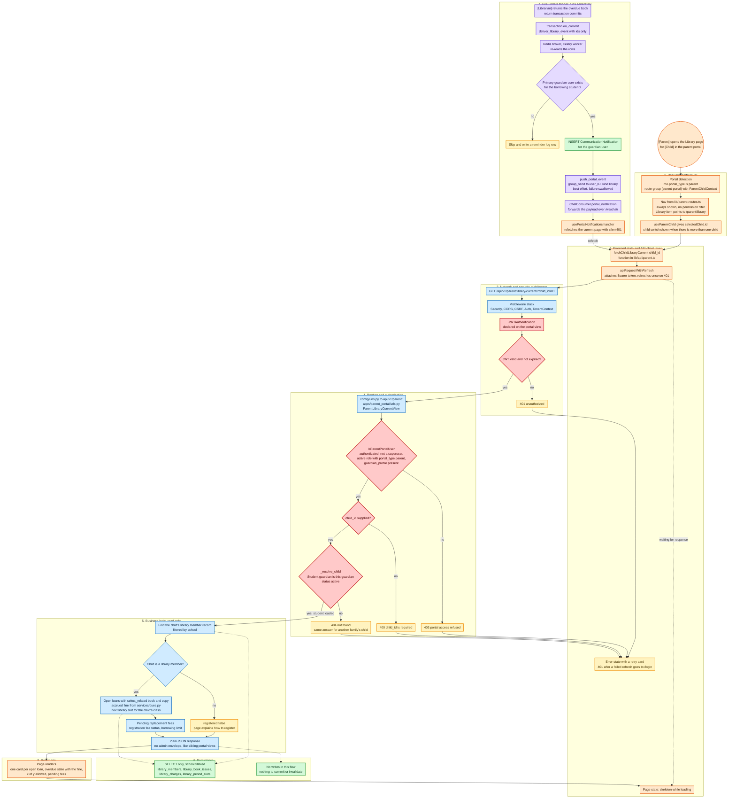

```mermaid
%%{init: {"flowchart": {"nodeSpacing": 24, "rankSpacing": 22, "padding": 6, "curve": "basis", "wrappingWidth": 340}, "themeVariables": {"fontSize": "13px"}}}%%
flowchart TD
  classDef fe fill:#FFE8CC,stroke:#E8590C,color:#3B1F00,stroke-width:1.5px
  classDef be fill:#D0EBFF,stroke:#1971C2,color:#0B2540,stroke-width:1.5px
  classDef sec fill:#FFC9C9,stroke:#C92A2A,color:#4A0000,stroke-width:2px
  classDef db fill:#D3F9D8,stroke:#2F9E44,color:#0B3D1A,stroke-width:1.5px
  classDef async fill:#E5DBFF,stroke:#6741D9,color:#24104F,stroke-width:1.5px
  classDef err fill:#FFF3BF,stroke:#F08C00,color:#4A3500,stroke-width:1.5px

  START(("[Librarian] scans or types the copy code<br/>Issue Desk, Return tab"))

  subgraph L1["1. User and portal layer"]
    P1["Portal detection<br/>GET /api/v1/auth/me/ gives me.portal_type<br/>admin or custom, routed to /library/issue-desk"]
    P2{"usePermissions cache<br/>fresh within 5 min TTL?"}
    P2a["Refetch /auth/me/ with silent401<br/>also on visibilitychange"]
    P3["useVisibleModules + hasFeature library flag<br/>Library module is visible"]
    P4{"UI gate: can library.book_issues.return?<br/>server still enforces it"}
    P4n["No-access state<br/>loading state while can is false"]
  end

  subgraph L2["2. Frontend state and API client layer"]
    F1["Search box, debounced<br/>GET books/lookup and issues/open/lookup<br/>silent401"]
    F2["Open loan card<br/>borrower, due date, accrued fine Rs 10,<br/>1 member waiting on hold"]
    F3["Librarian clicks Collect and return"]
    F4{"Client validation<br/>fine_action chosen when a fine is due?<br/>waive reason when waiving?"}
    F4e["Inline field error<br/>no network call"]
    F5["useLibraryApi.returnIssue<br/>no optimistic update for a money action"]
    F6["apiRequestWithRefresh<br/>attaches Bearer access token"]
    F7a["401 handling<br/>POST /api/v1/auth/refresh/"]
    F7b["Refresh failed<br/>clearAuthTokens, redirect to /login"]
    ER["useLibraryApi error class<br/>field_errors go to the form<br/>error.code goes to a toast<br/>503 shows try again later"]
  end

  subgraph L3["3. Network and security middleware"]
    N1["POST /api/v1/library/issues/ID/return/<br/>Django ASGI server"]
    N2["Middleware stack<br/>Security, CORS, CSRF, Auth, TenantContext"]
    N3["TenantAwareJWTAuthentication<br/>acts as plain JWT while multi-tenancy is off<br/>loads user and school_id"]
    N4{"JWT signature valid<br/>and not expired?"}
    N4e["401 unauthorized<br/>error envelope"]
  end

  subgraph L4["4. Routing and authorization"]
    R1["config/urls.py to api/v1/library/<br/>DefaultRouter matches IssueViewSet return action"]
    R2{"permission_classes<br/>IsAuthenticated + has_permission_code<br/>library.book_issues.return"}
    R2e["403 permission_denied"]
    R3["LibraryViewSet.get_queryset<br/>scope_to_school with user.school_id<br/>no is_superuser bypass"]
    R5["PortalScopeFilterBackend<br/>admin and custom portals pass through"]
    R4{"Loan id exists<br/>inside the user's school?"}
    R4e["404 not_found<br/>other schools look identical to missing"]
  end

  subgraph L5["5. Business logic and validation"]
    B1["Input serializer<br/>money, dates, statuses read-only<br/>unknown fields rejected"]
    B2{"serializer.validate<br/>fine_action rules<br/>cross-school FK check on optional<br/>lost or damaged report copy"}
    B3["400 validation_error<br/>with field_errors"]
    B4["services.circulation.return_loan<br/>transaction.atomic"]
    B5["select_for_update<br/>on the copy row and the loan row"]
    B6{"Loan still status issued?"}
    B6e["409 library_already_returned<br/>safe to retry"]
    B7["Server computes fine from library_settings<br/>days overdue minus grace, times rate, capped<br/>client never sends an amount"]
    B8{"fine_action"}
    B8a["Waive needs library.book_issues.waive_fine<br/>plus a written reason"]
  end

  subgraph L6["6. Persistence and data integrity"]
    D1["INSERT library_charges<br/>overdue_fine, paid or waived<br/>one fine charge per loan"]
    D2["UPDATE library_book_issues<br/>status returned, return_date, returned_at,<br/>returned_by, fine_amount"]
    D3["UPDATE library_book_copies<br/>status available"]
    D4["INSERT library_activity_logs<br/>return event, same transaction"]
    D5{"model.clean, CheckConstraints<br/>and UniqueConstraints pass?"}
    D5e["IntegrityError to central exception handler<br/>409 already_exists or 400 missing_required_field<br/>whole transaction rolls back, nothing queued"]
    D6["PostgreSQL COMMIT"]
    D7["Redis cache: no library data cached in V1<br/>nothing to invalidate<br/>Redis is the Celery broker and the WebSocket channel layer"]
  end

  subgraph L7["7. Asynchronous and event layer"]
    E1["transaction.on_commit hook<br/>runs only after a successful commit"]
    E2{"Any waiting holds<br/>on this title?"}
    E3["notify_hold_ready.delay<br/>school_id and hold_id only<br/>no phone or email in arguments"]
    E4["Redis broker<br/>queue default"]
    E5["Celery worker picks the task<br/>re-reads hold and member inside the task"]
    E6["Resolve the recipient<br/>student: primary guardian user<br/>teacher or staff: their own user"]
    E7{"Recipient has a portal user?"}
    E7e["Skip and write a reminder log row<br/>circulation is already committed<br/>never rolled back"]
    E8["INSERT CommunicationNotification<br/>plus activity log hold event<br/>the log row blocks duplicate sends"]
    E9["push_portal_event<br/>group_send to user_ID<br/>kind library, best effort"]
    E9e["Channel layer down<br/>failure swallowed, the saved row stays"]
    E10["Browser WebSocket receives portal_notification<br/>usePortalNotifications refetches the page<br/>with silent401"]
    E11["SMS or email through existing helpers<br/>off by default, setting notify_sms_email_enabled"]
  end

  subgraph L8["8. Return trip"]
    X1["Standard envelope<br/>success true, message, data with issue, fine,<br/>report_id, hold_queue_count, undo_expires_at"]
    X2["HTTP 200 JSON response"]
    X3["apiRequestWithRefresh resolves<br/>typed result"]
    X4["Hook updates state<br/>loan leaves the open list<br/>desk log refreshes, hold banner shows"]
    X5["Success toast: Returned, Rs 10 collected<br/>plus undo toast"]
    X6["Optional undo click<br/>POST issues/ID/undo-return/<br/>same user, inside undo window, copy unchanged"]
  end

  START --> P1 --> P2
  P2 -->|"stale"| P2a --> P3
  P2 -->|"fresh"| P3
  P3 --> P4
  P4 -->|"no"| P4n
  P4 -->|"yes"| F1
  F1 --> F2 --> F3 --> F4
  F4 -->|"invalid"| F4e
  F4 -->|"valid"| F5 --> F6 --> N1
  N1 --> N2 --> N3 --> N4
  N4 -->|"no"| N4e --> F7a
  F7a -->|"ok: retry once"| F6
  F7a -->|"fails"| F7b
  N4 -->|"yes: user and school_id set"| R1
  R1 --> R2
  R2 -->|"no"| R2e
  R2 -->|"yes"| R3 --> R5 --> R4
  R4 -->|"no"| R4e
  R4 -->|"yes"| B1 --> B2
  B2 -->|"invalid"| B3
  B2 -->|"valid"| B4 --> B5 --> B6
  B6 -->|"no"| B6e
  B6 -->|"yes"| B7 --> B8
  B8 -->|"collect"| D1
  B8 -->|"waive"| B8a
  B8a -->|"code present"| D1
  B8a -->|"code missing"| R2e
  D1 --> D2 --> D3 --> D4 --> D5
  D5 -->|"violation"| D5e
  D5 -->|"ok"| D6
  D6 -.-> D7
  D6 --> E1 --> E2
  E2 -->|"no hold"| X1
  E2 -->|"hold exists"| E3
  E3 -->|"enqueue returns at once"| X1
  E3 --> E4 --> E5 --> E6 --> E7
  E7 -->|"yes"| E8 --> E9
  E7 -->|"no"| E7e
  E9 --> E10
  E9 -->|"channel down"| E9e
  E8 -.->|"only if enabled"| E11
  X1 --> X2 --> X3 --> X4 --> X5 --> X6

  B3 --> ER
  B6e --> ER
  D5e --> ER
  R2e --> ER
  R4e --> ER
  ER -->|"form stays open, nothing is lost"| F3

  class START,P1,P2,P2a,P3,P4,F1,F2,F3,F4,F5,F6,F7a,X3,X4,X5,X6,E10 fe
  class N1,N2,R1,B1,B4,B5,B6,B7,B8,X1,X2 be
  class N3,N4,R2,R3,R5,R4,B2,B8a sec
  class D1,D2,D3,D4,D5,D6,D7,E8 db
  class E1,E2,E3,E4,E5,E6,E7,E9,E11 async
  class P4n,F4e,F7b,ER,N4e,R2e,R4e,B3,B6e,D5e,E7e,E9e err
```

# Library Module: End-to-End Pipeline Flows

Two traced examples. Colours: orange frontend, blue backend, red security gates, green database, purple async, yellow errors.

# Flow 1: Librarian request

## Concrete example

A librarian returns an overdue copy of a title at the Issue Desk, and another member is waiting on a hold for it. The loan is one day overdue, so a fine of ₹10 is due. The librarian chooses "Collect and return". The server computes the fine, closes the loan, frees the copy and tells the waiting member the book is back. Names are placeholders: [Librarian], [Borrower], [Waiting Member].

## Diagram

## Narrative

### Orange: user and frontend
- **Portal detection.** The librarian's session already has a profile from the auth endpoint. Its portal type is admin or custom, so the router sends them to the Library module.
- **Permission cache.** The permissions hook reuses its cached profile for 5 minutes. After that, or when the tab regains focus, it refetches quietly without forcing a logout.
- **Nav and buttons.** Module visibility comes from the visible-modules hook and the library feature flag. The "Collect and return" button shows only if the user holds the return code. Hiding a button is a convenience, and the server checks again.
- **Lookup.** Typing or scanning a copy code runs two debounced background lookups. The open loan card shows the borrower, due date, the ₹10 accrued fine and the waiting hold.
- **Client check and send.** If a fine is due, the form requires a fine action, and a waiver also needs a reason. A failure shows an inline error with no network call. A money action is not applied optimistically. The screen waits for the server.
- **Token handling.** The API client attaches the access token. On a 401 it refreshes once and retries. If the refresh fails, it clears tokens and redirects to login.

### Red: security gates, in order
- **JWT check.** The tenant-aware authenticator validates the token and loads the user and school. While multi-tenancy is off, it behaves as plain JWT.
- **Permission check.** The ViewSet checks the exact return code. School admins and superusers pass through the existing code check.
- **Waive check.** Choosing "waive" additionally needs the waive-fine code.
- **School scoping.** Every query goes through the school filter with no superuser bypass. A loan id from another school returns 404.
- **Portal filter.** Admin and custom portals pass through unchanged.
- **Serializer validation.** Money, dates and statuses are read-only, and unknown fields are rejected. Any related object in the payload, such as a lost or damaged report copy, must belong to the same school.

### Blue: backend routing and logic
- The router matches the return action on the loan ViewSet. The ViewSet validates input and hands the work to a service function.
- The service runs in one transaction and locks the copy and loan rows. If another desk returned the loan a moment earlier, the user gets a 409 that is safe to retry.
- The server computes the fine from the school's settings. The client never sends an amount.

### Green: persistence
- The service writes the paid fine charge, closes the loan, frees the copy and adds an activity log row.
- Model validation and database constraints guard these writes. If one fails, the central handler returns 409 or 400, the transaction rolls back and nothing is queued.
- After commit succeeds, the flow moves to the next layer.

### Purple: asynchronous work
- After commit, a hook checks for waiting holds. If one exists, it queues a hold-ready task with ids only.
- Redis passes the task to a Celery worker. The worker re-reads the hold and finds the recipient. A student's notice goes to the primary guardian. A teacher's or staff member's goes to their own account.
- The worker saves a notification row and pushes it over the existing WebSocket group. If the push fails, the saved row stays and the return is not affected.
- SMS and email use the existing helpers but are off by default.

### Orange and blue: the return trip
- The server wraps the result in the standard success envelope. It includes the loan, the fine, the hold count and the undo deadline.
- The hook removes the loan from the open list, refreshes the desk log and shows a hold banner. The librarian sees "Returned, ₹10 collected" plus an undo toast. Undo works only for the same user, inside the window, and only if the copy has not been re-issued.

### Yellow: failures
Every 400, 403, 404 and 409 lands in one error handler in the API hook. Field errors go to the form and error codes go to a toast. The form stays open, so nothing the librarian typed is lost.

### Where this differs from the generic template
- **No Redis cache.** The blueprint caches no library data in V1, so there is nothing to invalidate. Redis is only the Celery broker.
- **No post-save signals.** The blueprint queues tasks from the service after commit. That avoids sending a notification for a transaction that later rolls back.
- **WebSocket for portals only.** Teachers and parents get a live push through the WebSocket group the portals already use. The librarian console polls every 30 seconds instead.

---

# Flow 2: Portal connectivity (parent, with teacher differences)

## Concrete example

A parent opens the Library page for one child and sees an overdue book with its fine. While the page is open, the librarian returns that book. The parent's page updates by itself. Names are placeholders: [Parent], [Child], [Librarian].

## Diagram

## Narrative

### How the parent request is checked
- **Portal and nav.** The session's portal type is parent, so the app uses the parent layout. The parent nav list is always shown in full. Its Library item points to the new Library page.
- **Child choice.** The page reads the selected child from the shared child context. The child switch appears only when the parent has more than one child.
- **Request.** A fetch function in the parent API file calls the API client, which attaches the token and refreshes it once on a 401.
- **Authentication.** The portal view declares JWT authentication. An invalid or expired token returns 401.
- **Portal gate.** The parent access class requires a signed-in user who is not a superuser, holds an active role of portal type parent, and has a guardian profile. Anything else returns 403. No permission codes are involved.
- **Child ownership.** The existing child resolver requires a child id, then loads only an active student whose guardian is this parent. A child from another family gets the same 404 as a child that does not exist.
- **Read-only logic.** A service finds the child's library member record, collects open loans, computes the accrued fine with the same function the librarian desk uses, and adds the next library period and pending fees. A child who is not a member gets an explicit "not registered" answer, not an error.
- **Response.** Plain JSON, the same style as the other parent endpoints. The page replaces its skeleton with one card per loan.

### How the live update arrives
- **Trigger.** The librarian's return commits. After the commit, a background task starts with ids only.
- **Recipient.** The worker finds the borrowing student's primary guardian user. If there is none, it skips and logs the reason.
- **Delivery.** It saves a notification row, then pushes a library event to that user's WebSocket group. The existing consumer forwards the payload unchanged.
- **Refresh.** The parent's notification hook receives the event and refetches the current page quietly. The parent sees the updated state without reloading.
- **Failure.** If the push fails, the saved row stays and the librarian's return is unaffected.

### Teacher portal differences
- **Access class.** The teacher access class also requires a linked staff profile.
- **My Class scope.** Loans are limited to students in the teacher's class-teacher assignment. A loan outside that scope returns 404. A teacher with no assignment sees an empty state.
- **My Books.** The teacher's own member record is found through their staff profile. Only their own loans can be renewed.
- **Notifications.** The existing teacher notification bell already reads the saved rows.

### Why this holds up in production
- **No trusted ids.** Every id from the browser is checked against the signed-in person's own data before any query runs.
- **Same rules as the siblings.** The new endpoints copy the existing parent and teacher endpoints, so there is nothing new to learn or secure.
- **No new infrastructure.** Push reuses the existing WebSocket route and group.
- **Safe failure.** Push and notification failures never roll back circulation.
